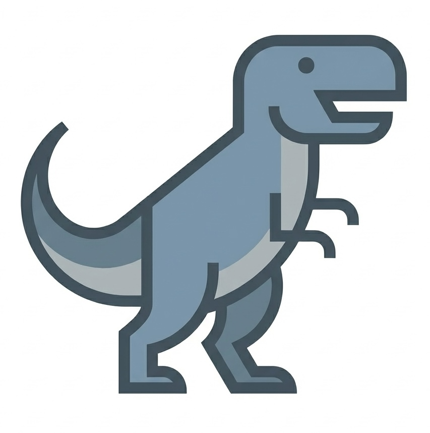

<p align="center">
  
</p>

<h1 align="center">Dodo Recorder</h1>

<p align="center">
  A desktop application for recording browser interactions and voice commentary, producing session bundles for AI-assisted Playwright test generation.
</p>

## Quick Usage

**Recording Widget:** A floating widget appears in the browser when recording starts (top-right corner). Use it to:
- Take screenshots
- Toggle assertion mode (auto-disables after recording an assertion)
- Drag to reposition

Note: Interactions with the widget are never recorded.

**Keyboard Shortcuts:**

| Key | Action |
|-----|--------|
| **Cmd+Shift+S** (Mac)<br>**Ctrl+Shift+S** (Windows/Linux) | Take Screenshot |
| **Alt/Option + Click** | Record Assertion (verify element exists) |

> **Tip**: Speak your commentary while recording. The app automatically syncs your voice with your actions.

---

## Developer Setup

### Prerequisites

- **Node.js 18+** and npm
- **Git**

### Installation

#### 1. Clone and Install Dependencies

```bash
git clone <repository-url>
cd dodo-recorder
npm install
```

#### 2. Download Whisper Model (REQUIRED - One-time setup)

**The model file is not in the repository (466 MB). You must download it once:**

```bash
curl -L -o models/ggml-small.en.bin https://huggingface.co/ggerganov/whisper.cpp/resolve/main/ggml-small.en.bin
```

**That's it!** The whisper.cpp binary is already committed in the repository.

#### 3. Verify Setup

```bash
# Check that the model was downloaded
ls -lh models/ggml-small.en.bin
```

Expected output:
```
-rw-r--r--  models/ggml-small.en.bin      # ~466M file size
```

### Running the App

#### Development Mode

```bash
npm run dev
```

#### Production Build

```bash
npm run electron:build
```

This creates a distributable app in the `release/` folder.

**What gets bundled:**
- Whisper.cpp binary (from `models/whisper` → `Resources/models/whisper`)
- Whisper model (from `models/ggml-small.en.bin` → `Resources/models/ggml-small.en.bin`)

### Project Structure

```
dodo-recorder/
├── models/                          # Whisper components
│   ├── whisper                     # Whisper.cpp binary (committed to git)
│   └── ggml-small.en.bin          # AI model (download manually, gitignored)
├── electron/                        # Electron main process
├── src/                             # React renderer process
└── docs/                            # Documentation
```

### What's in the `models/` Folder?

Whisper transcription requires **TWO files**, both in `models/`:

#### 1. Whisper Binary (`models/whisper` - 1 MB)
- **Status:** ✅ Committed to git (already in repo)
- **Purpose:** Executable program that performs transcription
- **Platform:** macOS binary included (Windows/Linux: build from source if needed)

#### 2. Whisper Model (`models/ggml-small.en.bin` - 466 MB)
- **Status:** ⚠️ Must download manually (too large for git)
- **Purpose:** AI model weights used by the binary
- **Download once:** File stays on your machine

---

## Troubleshooting

### "Whisper model not found" Error

**Problem:** App can't find `models/ggml-small.en.bin`

**Solution:**
```bash
curl -L -o models/ggml-small.en.bin https://huggingface.co/ggerganov/whisper.cpp/resolve/main/ggml-small.en.bin
```

### "Whisper binary not found" Error

**Problem:** Binary not found at `models/whisper`

**Solution:** The binary should be committed to git. Pull the latest code:
```bash
git pull origin main
```

### Model Download Fails

**Problem:** `curl` command fails or times out

**Solution:** Download manually from browser:
1. Go to: https://huggingface.co/ggerganov/whisper.cpp/tree/main
2. Download `ggml-small.en.bin`
3. Place it in `models/ggml-small.en.bin`

### On Windows/Linux

The committed binary is for macOS. If you're on Windows or Linux, you'll need to build whisper.cpp:

```bash
# Clone and build whisper.cpp
git clone https://github.com/ggerganov/whisper.cpp.git /tmp/whisper
cd /tmp/whisper
git checkout v1.5.4
make main

# Copy to your project
cp main /path/to/dodo-recorder/models/whisper
chmod +x /path/to/dodo-recorder/models/whisper
```

---

## FAQs

**Q: Why is the model not in git?**  
A: It's 466 MB, which is too large for git. Download it once manually.

**Q: Why is the binary in git?**  
A: It's only 1 MB and makes setup much simpler - just one download step instead of two.

**Q: Can I use a different model?**  
A: No, the app is hard-coded to use `small.en` only for simplicity and consistency.

**Q: Do I need to download the model every time I clone?**  
A: Yes, but only once per machine. The file persists across npm installs.

**Q: What if I'm not on macOS?**  
A: You'll need to build the whisper.cpp binary for your platform (see troubleshooting section).

---

## Documentation

- **[User Guide](docs/user_guide.md)**: Features, usage, keyboard shortcuts, and output formats
- **[Architecture](docs/architecture.md)**: System design, data flow, technical details, and project structure
- **[Voice Transcription](docs/voice_transcription.md)**: Deep dive into the local voice transcription system
- **[Output Format](docs/output_format.md)**: Detailed explanation of the session output format refactoring
- **[Initial Vision](docs/initial_vision.md)**: Original project vision and design principles

## License

MIT
