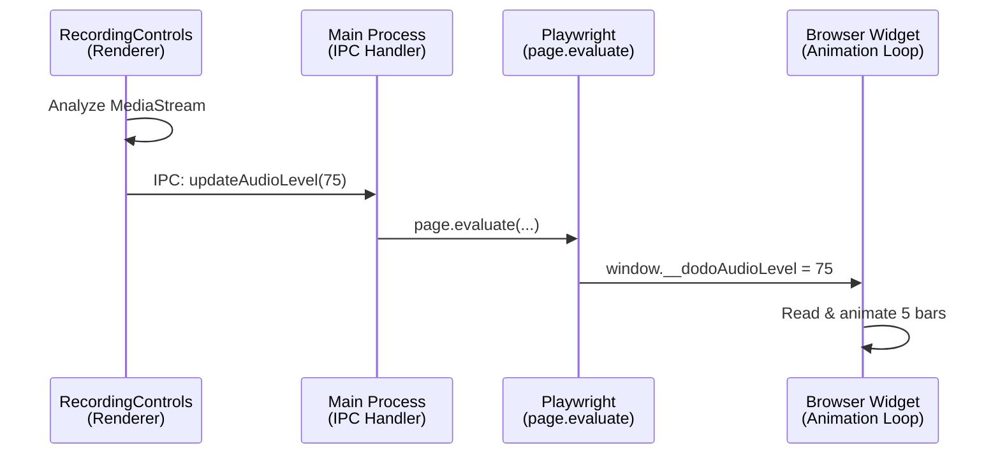

# Browser Recording Widget

## Overview

The recording widget is a floating UI control that appears in the browser window during recording sessions. It provides quick access to screenshot capture and assertion mode, enhancing the recording experience without interfering with the page being tested.

**Key Design Principles:**
- **Non-intrusive**: Uses Shadow DOM to prevent CSS conflicts
- **Isolated**: Widget interactions are never recorded as actions
- **Accessible**: Draggable, snaps to edges, keyboard shortcut alternatives
- **Visual feedback**: Hover states, active states, smooth animations

---

## Architecture

### Injection Mechanism

The widget is injected into every page via Playwright's [`page.addInitScript()`](../electron/browser/recorder.ts:83) during browser recording initialization:

```typescript
// In recorder.ts
await this.page.addInitScript(`window.__dodoCreateWidget = ${getWidgetScript().toString()}`)
await this.page.addInitScript(getWidgetInitScript())
```

**Two-phase injection:**
1. **Widget creation function** - Serialized and exposed as `window.__dodoCreateWidget`
2. **Widget initialization script** - Calls the creation function when DOM is ready

This approach ensures:
- Widget code is available before page scripts load
- Works with single-page applications (SPAs)
- Survives page navigation (re-injected on each page load)

### Shadow DOM Isolation

The widget uses **closed Shadow DOM** to prevent styling conflicts:

```typescript
const widgetHost = document.createElement('div')
widgetHost.id = '__dodo-recorder-widget-host'
const shadow = widgetHost.attachShadow({ mode: 'closed' })
```

**Benefits:**
- Page CSS cannot affect widget styling
- Widget CSS cannot leak to page
- Complete encapsulation of widget internals
- Protection from page JavaScript manipulation

**Structure:**
```
<div id="__dodo-recorder-widget-host">  ← Host in page DOM
  #shadow-root (closed)                  ← Shadow boundary
    <style>...</style>                   ← Widget styles
    <div class="dodo-widget">            ← Widget container
      <button class="widget-btn">...</button>
      <button class="widget-btn">...</button>
    </div>
</div>
```

---

## Features

**Feature Index:**
1. Screenshot Button
2. Assertion Button
3. Audio Equalizer - 5-bar real-time level visualization
4. Drag and Drop
5. Edge Snapping

### 1. Screenshot Button

**Visual Design:**
- Camera icon with detailed SVG styling
- Dark gray camera body with lighter stroke
- Multi-layered lens (outer circle + inner aperture)
- Size: 22x22px

**Interactions:**
- **Click**: Captures screenshot immediately
- **Flash animation**: Visual feedback on capture
- **Tooltip**: Shows "Screenshot (Cmd+Shift+S)" on hover

**Implementation:**
```typescript
screenshotBtn.addEventListener('click', async (e) => {
  e.stopPropagation()
  
  // Visual feedback
  screenshotBtn.classList.add('flash')
  setTimeout(() => screenshotBtn.classList.remove('flash'), 300)
  
  // Capture screenshot
  const screenshotPath = await takeScreenshot()
  if (screenshotPath) {
    recordAction(JSON.stringify({
      type: 'screenshot',
      screenshot: screenshotPath,
    }))
  }
})
```

### 2. Assertion Button

**Visual Design:**
- Eye icon with detailed iris/pupil rendering
- Multi-layered circles for depth (4 layers + highlight)
- Very dark pupil with light reflection for realism
- Active state: Blue-tinted theme

**Interactions:**
- **Click**: Toggles assertion mode on/off
- **Active state**: Blue background + modified icon colors
- **Tooltip**: Shows "Assertion Mode (Cmd+Click / Ctrl+Click)" on hover

**Behavior:**
- When active: All clicks on page become assertions
- Auto-disables: After recording one assertion
- Visual indicator: Button highlighted in blue when active

**State Management:**
```typescript
let assertionModeActive = false

assertionBtn.addEventListener('click', (e) => {
  e.stopPropagation()
  assertionModeActive = !assertionModeActive
  
  if (assertionModeActive) {
    assertionBtn.classList.add('active')
  } else {
    assertionBtn.classList.remove('active')
  }
})

// Expose to injected script for coordination
window.__dodoAssertionMode = () => assertionModeActive
window.__dodoDisableAssertionMode = () => {
  assertionModeActive = false
  assertionBtn.classList.remove('active')
}
```

### 3. Audio Equalizer (NEW ✨)

**Visual Design:**
- Compact 5-bar equalizer visualization
- Size: ~55px × 35px
- Displays alongside screenshot and assertion buttons
- Only visible during voice recording

**Interactions:**
- **Auto-show**: Appears when audio recording starts
- **Auto-hide**: Disappears when recording stops
- **Real-time**: Updates 60fps based on microphone input
- **Visual feedback**: Color changes based on audio level

**Implementation:**
```typescript
// Equalizer structure (5 bars)
<div class="audio-equalizer">
  <div class="eq-bar" data-bar-index="0"></div>
  <div class="eq-bar" data-bar-index="1"></div>
  <div class="eq-bar" data-bar-index="2"></div>
  <div class="eq-bar" data-bar-index="3"></div>
  <div class="eq-bar" data-bar-index="4"></div>
</div>

// Animation loop reads global audio level
const level = window.__dodoAudioLevel || 0

// Each bar height varies with wave pattern for visual interest
const variance = Math.sin(Date.now() / 200 + offset) * 0.3 + 0.7
const barHeight = level * variance
```

**Color Logic:**
- **Green** (0-50%): `#22c55e` - Normal speech range
- **Yellow** (50-75%): `#eab308` - Loud speech
- **Red** (75-100%): `#ef4444` - Very loud/clipping risk

**Data Bridge:**

The equalizer receives audio level data through a three-layer bridge:



1. **RecordingControls** analyzes audio stream with AudioContext
2. Calculates RMS level (0-100) every frame
3. Sends via IPC to main process
4. **Main process** uses Playwright's `page.evaluate()` to inject level
5. **Widget** reads `window.__dodoAudioLevel` in animation loop
6. Updates 5 bar heights and colors accordingly

**Why this approach?**
- Widget code must be self-contained (no imports)
- Renderer and browser are separate windows
- IPC + Playwright bridge provides real-time updates
- Animation loop handles visual smoothing
- 5 bars provide good balance between detail and compactness

### 4. Drag and Drop

**User Experience:**
- **Grab**: Click anywhere on widget to start dragging
- **Drag**: Widget follows cursor smoothly
- **Release**: Widget snaps to nearest screen edge
- **Visual feedback**: Opacity changes during drag

**Implementation Details:**

```typescript
let isDragging = false
let dragStartX = 0, dragStartY = 0
let widgetStartX = 0, widgetStartY = 0

widget.addEventListener('mousedown', (e) => {
  isDragging = true
  widget.classList.add('dragging')
  
  const pos = getWidgetPosition()
  dragStartX = e.clientX
  dragStartY = e.clientY
  widgetStartX = pos.x
  widgetStartY = pos.y
  
  e.preventDefault()
})

document.addEventListener('mousemove', (e) => {
  if (!isDragging) return
  
  const deltaX = e.clientX - dragStartX
  const deltaY = e.clientY - dragStartY
  
  setWidgetPosition(
    widgetStartX + deltaX,
    widgetStartY + deltaY
  )
})

document.addEventListener('mouseup', () => {
  if (!isDragging) return
  
  isDragging = false
  widget.classList.remove('dragging')
  snapToEdge()  // Snap to nearest edge
})
```

### 5. Edge Snapping

After dragging, the widget automatically snaps to the nearest screen edge with smooth animation:

**Algorithm:**
1. Calculate distances to all four edges (top, right, bottom, left)
2. Find minimum distance
3. Animate widget to that edge with 20px padding
4. Use cubic-bezier easing for natural feel

```typescript
const snapToEdge = () => {
  const pos = getWidgetPosition()
  const viewportWidth = window.innerWidth
  const viewportHeight = window.innerHeight
  
  // Calculate distances
  const distToTop = pos.y
  const distToBottom = viewportHeight - (pos.y + pos.height)
  const distToLeft = pos.x
  const distToRight = viewportWidth - (pos.x + pos.width)
  
  const minDist = Math.min(distToTop, distToBottom, distToLeft, distToRight)
  
  // Snap to nearest edge
  const padding = 20
  let newX = pos.x, newY = pos.y
  
  if (minDist === distToTop) newY = padding
  else if (minDist === distToBottom) newY = viewportHeight - pos.height - padding
  else if (minDist === distToLeft) newX = padding
  else if (minDist === distToRight) newX = viewportWidth - pos.width - padding
  
  // Animate
  widget.classList.add('snapping')
  setWidgetPosition(newX, newY)
  setTimeout(() => widget.classList.remove('snapping'), 300)
}
```

---

## Styling

### Design System

**Color Palette:**
- Background: `rgba(10, 10, 11, 0.95)` - Nearly black with slight transparency
- Border: `rgba(255, 255, 255, 0.1)` - Subtle white outline
- Button background: `rgba(255, 255, 255, 0.05)` - Very subtle
- Button hover: `rgba(255, 255, 255, 0.12)` - Slightly brighter
- Active state: `rgba(59, 130, 246, 0.25)` - Blue tint
- Shadow: `0 4px 12px rgba(0, 0, 0, 0.3)` - Soft elevation

**Typography:**
- Font: System font stack (`-apple-system, BlinkMacSystemFont, 'Segoe UI', sans-serif`)
- Size: 14px base, 12px tooltips

**Spacing:**
- Widget padding: 8px
- Button gap: 8px
- Button padding: 8px 12px
- Button size: 40x40px minimum

**Transitions:**
- Opacity: 0.2s ease
- Snapping: 0.3s cubic-bezier(0.4, 0, 0.2, 1)
- SVG colors: 0.2s ease
- Button transform: Instant (scale on click)

### SVG Icon Styling

**Screenshot Icon (Camera):**
```html
<svg viewBox="0 0 24 24">
  <!-- Camera body: dark gray with lighter stroke -->
  <path fill="rgba(100, 116, 139, 0.8)" stroke="rgba(148, 163, 184, 0.9)" />
  
  <!-- Lens: darker circle -->
  <circle fill="rgba(51, 65, 85, 0.9)" stroke="rgba(148, 163, 184, 0.9)" />
  
  <!-- Aperture: very dark center -->
  <circle fill="rgba(30, 41, 59, 1)" />
</svg>
```

**Assertion Icon (Eye):**
```html
<svg viewBox="0 0 24 24">
  <!-- Eye shape: dark gray -->
  <path fill="rgba(100, 116, 139, 0.7)" stroke="rgba(148, 163, 184, 0.9)" />
  
  <!-- Iris outer: layered for depth -->
  <circle fill="rgba(71, 85, 105, 0.9)" stroke="rgba(148, 163, 184, 0.9)" />
  
  <!-- Iris inner: darker -->
  <circle fill="rgba(30, 41, 59, 1)" stroke="rgba(51, 65, 85, 0.8)" />
  
  <!-- Pupil: very dark -->
  <circle fill="rgba(15, 23, 42, 1)" />
  
  <!-- Highlight: light reflection -->
  <circle fill="rgba(226, 232, 240, 0.8)" />
</svg>
```

**Hover Effects:**
- Outer shapes brighten (`rgba(120, 136, 159, 0.9)`)
- Strokes become more visible

**Active State (Assertion):**
- Blue-tinted fills for all layers
- More pronounced strokes

### Tooltips

**Design:**
- Position: Above button, centered
- Background: `rgba(0, 0, 0, 0.9)` - Solid black
- Arrow: Pointing down to button
- Delay: 0.5s before showing
- Animation: Fade in with opacity

**Keyboard Shortcuts:**
- Automatically detects OS (Mac vs Windows/Linux)
- Shows appropriate modifier key (Cmd vs Ctrl, Option vs Alt)

---

## Integration with Recording System

### Preventing Widget Recording

The widget uses a unique host ID to prevent its interactions from being recorded:

```typescript
// In injected-script.ts
const WIDGET_HOST_ID = '__dodo-recorder-widget-host'

const isWithinWidget = (target: Element): boolean => {
  const widgetHost = document.getElementById(WIDGET_HOST_ID)
  return !!(widgetHost && (widgetHost.contains(target) || widgetHost === target))
}

// Check before recording any action
document.addEventListener('click', (e) => {
  const target = e.target as Element
  if (!target || isWithinWidget(target)) return  // Skip widget clicks
  
  // Record the action...
})
```

**All event listeners check `isWithinWidget()` before recording:**
- Click events
- Input events
- Keyboard events
- Selection events

### Communication with Injected Script

The widget exposes functions to `window` for coordination:

```typescript
// Widget → Injected Script
window.__dodoAssertionMode = () => assertionModeActive
window.__dodoDisableAssertionMode = () => {
  assertionModeActive = false
  assertionBtn.classList.remove('active')
}

// Injected Script → Widget
const win = window as unknown as DodoWindow
const assertMode = win.__dodoAssertionMode && win.__dodoAssertionMode()
if (assertMode && win.__dodoDisableAssertionMode) {
  win.__dodoDisableAssertionMode()  // Auto-disable after assertion
}
```

### Accessing Exposed Functions

The widget calls functions exposed by the recorder:

```typescript
// Exposed by recorder.ts via page.exposeFunction()
const recordAction = window.__dodoRecordAction
const takeScreenshot = window.__dodoTakeScreenshot

// Used in widget button handlers
screenshotBtn.addEventListener('click', async () => {
  const screenshotPath = await takeScreenshot()
  if (screenshotPath) {
    recordAction(JSON.stringify({
      type: 'screenshot',
      screenshot: screenshotPath,
    }))
  }
})
```

---

## Technical Considerations

### Self-Contained Code

**Critical Requirement:** The widget code must be completely self-contained because it's serialized and injected as a string.

**What's allowed:**
- ES6+ syntax (arrow functions, const/let, template literals)
- TypeScript interfaces (compiled away)
- Window API access
- DOM manipulation

**What's NOT allowed:**
- External imports (`import { x } from 'y'`)
- Node.js modules
- Module-level variables (must be inside function scope)

**Example of correct pattern:**
```typescript
export function getWidgetScript(): () => void {
  return () => {
    // ✅ Constants INSIDE the function
    const WIDGET_HOST_ID = '__dodo-recorder-widget-host'
    
    // ✅ All logic self-contained
    interface DodoWindow extends Window {
      __dodoRecordAction: (data: string) => void
    }
    
    // ... rest of widget code
  }
}
```

**Example of incorrect pattern:**
```typescript
// ❌ Module-level constant (not serialized)
const WIDGET_HOST_ID = '__dodo-recorder-widget-host'

export function getWidgetScript(): () => void {
  return () => {
    // This will fail: WIDGET_HOST_ID is not defined in browser context
    const widget = document.getElementById(WIDGET_HOST_ID)
  }
}
```

### Duplicate Prevention

The widget checks if it already exists before creating:

```typescript
if (document.getElementById(WIDGET_HOST_ID)) {
  console.log('[Dodo Recorder] Widget already exists, skipping creation')
  return
}
```

This prevents:
- Multiple widgets on page reload
- Conflicts with SPA route changes
- Memory leaks from duplicate event listeners

### React Page Compatibility

To prevent React from interfering with the widget:

```typescript
widgetHost.setAttribute('data-dodo-recorder', 'true')
```

This signals to frameworks that this element is externally managed.

---

## Files

### Implementation Files

| File | Purpose | Lines |
|------|---------|-------|
| [`electron/browser/recording-widget.ts`](../electron/browser/recording-widget.ts) | Widget implementation and styling | ~400 |
| [`electron/browser/injected-script.ts`](../electron/browser/injected-script.ts) | Event recording with widget exclusion | ~390 |
| [`electron/browser/recorder.ts`](../electron/browser/recorder.ts) | Widget injection during recording start | ~170 |

### Key Functions

**Widget Creation:**
- [`getWidgetScript()`](../electron/browser/recording-widget.ts:12) - Returns widget creation function
- [`getWidgetInitScript()`](../electron/browser/recording-widget.ts:376) - Returns initialization wrapper

**Exclusion Logic:**
- [`isWithinWidget()`](../electron/browser/injected-script.ts:258) - Checks if element is inside widget

**Injection:**
- [`setupEventListeners()`](../electron/browser/recorder.ts:56) - Injects scripts into page

---

## User Experience

### First-Time Use

1. User clicks "Start Recording" in Dodo Recorder app
2. Browser launches with the target URL
3. Widget appears in top-right corner (default position)
4. User can immediately use widget or drag it to preferred location

### Typical Workflow

1. **Normal interaction**: Click page elements normally (recorded as clicks)
2. **Assertion mode**: Click widget eye button → click elements → assertions recorded
3. **Screenshots**: Click widget camera button or press Cmd+Shift+S
4. **Repositioning**: Drag widget to different screen edge if it blocks content

### Accessibility

- **Draggable**: Widget can be moved away from important content
- **Edge snapping**: Automatically positions at screen edges for consistency
- **Tooltips**: Clear labels for all functions
- **Keyboard shortcuts**: All widget functions have keyboard alternatives
- **Visual feedback**: Clear states (hover, active, dragging)

---

## Future Enhancements

Potential improvements to consider:

1. **Position persistence**: Remember widget position across sessions
2. **Resize handle**: Allow users to make widget smaller/larger
3. **Minimize button**: Collapse to small icon when not needed
4. **Additional buttons**: Pause/resume, add comment, mark important moment
5. **Status indicator**: Show recording status (active/paused)
6. **Keyboard shortcut customization**: Let users configure shortcuts
7. **Theme options**: Light/dark mode toggle
8. **Transparency slider**: Adjust widget opacity

---

## Summary

The browser recording widget is a sophisticated UI component that enhances the recording experience while maintaining complete isolation from the page being tested. Its key strengths are:

- **Shadow DOM encapsulation** prevents CSS conflicts
- **Smart edge snapping** keeps widget accessible but unobtrusive  
- **Visual feedback** makes interactions clear and satisfying
- **Self-contained code** ensures reliable injection across all pages
- **Careful exclusion logic** prevents widget interactions from being recorded
- **Detailed SVG icons** improve visual distinction and usability

The widget demonstrates how to build robust, isolated UI components in a browser automation context while providing a polished user experience.
