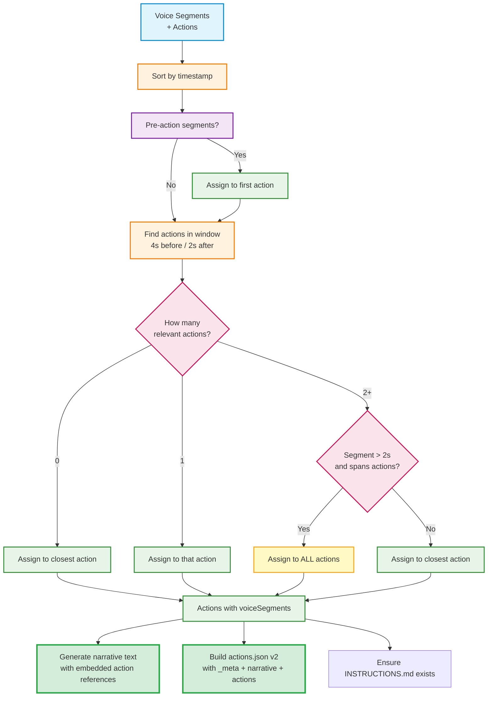
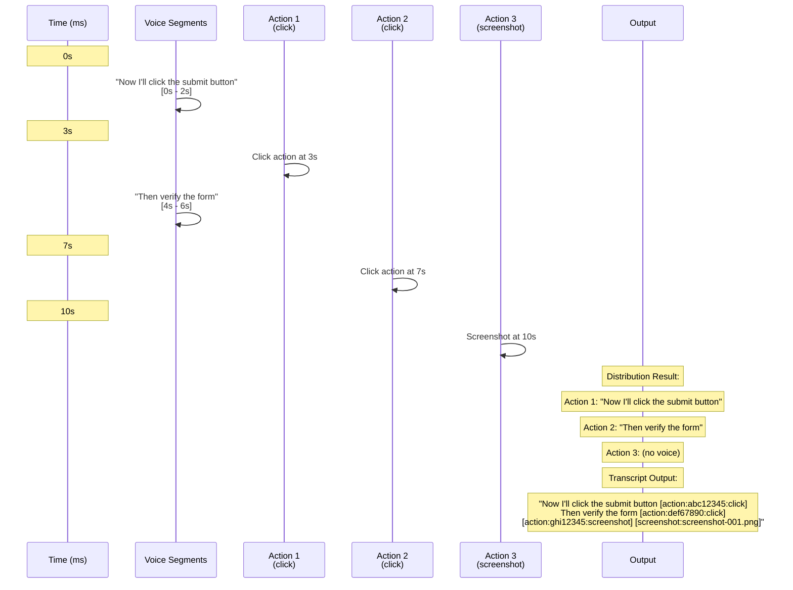

# Voice Transcription

**Last Updated**: January 2026  
**Status**: ✅ Enhanced with Sentence-Level Action Distribution

---

## Table of Contents

1. [Overview](#overview)
2. [Pipeline Architecture](#pipeline-architecture)
3. [Stage 1: Audio Capture & Transcription](#stage-1-audio-capture--transcription)
4. [Stage 2: Voice Distribution](#stage-2-voice-distribution)
5. [Stage 3: Transcript Generation](#stage-3-transcript-generation)
6. [Sentence-Level Action Distribution](#sentence-level-action-distribution)
7. [Whisper Model Configuration](#whisper-model-configuration)
8. [Output Format](#output-format)
9. [Data Flow & Examples](#data-flow--examples)
10. [Troubleshooting](#troubleshooting)
11. [Performance Characteristics](#performance-characteristics)
12. [Configuration](#configuration)
13. [Privacy & Security](#privacy--security)
14. [Future Enhancements](#future-enhancements)
15. [References](#references)

---

## Overview

Dodo Recorder uses OpenAI's Whisper model (via whisper.cpp) to transcribe voice commentary during browser recording sessions. The transcription runs locally for privacy and produces timestamped segments that are intelligently distributed across recorded actions, then woven into a natural narrative.

**Key Features:**
- **100% Local Processing** - No cloud services, no API keys required
- **Optimized for Early Speech Detection** - Captures the first seconds reliably
- **Intelligent Action Association** - Temporal proximity algorithm with tight time windows
- **Sentence-Level Precision** - Actions placed exactly where mentioned in narrative
- **Human & AI Readable** - Natural flow for humans, structured for LLM test generation

The complete pipeline transforms raw audio recordings and browser actions into a human-readable, AI-friendly narrative through three main stages:

1. **Audio Transcription** - Convert voice audio to timestamped text segments using Whisper.cpp
2. **Voice Distribution** - Associate voice segments with browser actions based on temporal proximity
3. **Transcript Generation** - Interleave actions within sentences for precise, natural reading flow

---

## Pipeline Architecture

```
┌─────────────────────────────────────────────────────────────┐
│                    Recording Complete                        │
└─────────────────────────────────────────────────────────────┘
                              ↓
┌─────────────────────────────────────────────────────────────┐
│  Stage 1: Audio Transcription (Whisper.cpp)                 │
│  • Capture audio via Web Audio API (MediaRecorder)          │
│  • Convert WebM → WAV with 1.5s silence padding             │
│  • Run Whisper model with optimized parameters              │
│  • Parse JSON output into timestamped segments              │
│  • Subtract 1500ms offset to account for padding            │
└─────────────────────────────────────────────────────────────┘
                              ↓
                  [TranscriptSegment[]]
                  (Voice with timestamps)
                              ↓
┌─────────────────────────────────────────────────────────────┐
│  Stage 2: Voice Distribution (voiceDistribution.ts)         │
│  • Tighter time windows (4s lookback, 2s lookahead)         │
│  • Find actions within temporal window of each segment      │
│  • Assign segments to nearest actions                       │
│  • Handle overlapping/split segments intelligently          │
└─────────────────────────────────────────────────────────────┘
                              ↓
            [RecordedAction[] with voiceSegments]
            (Actions with associated voice)
                              ↓
┌─────────────────────────────────────────────────────────────┐
│  Stage 3: Transcript Generation (enhancedTranscript.ts)     │
│  • NEW: Split voice segments into sentences                 │
│  • NEW: Calculate proportional timestamps per sentence      │
│  • NEW: Interleave actions within sentences                 │
│  • Generate complete narrative with embedded action refs    │
│  • Create action reference table                            │
└─────────────────────────────────────────────────────────────┘
                              ↓
                      [actions.json]
         (_meta + narrative + actions - all-in-one)
```

---

## Stage 1: Audio Capture & Transcription

**Files**: 
- [`electron/audio/transcriber.ts`](../electron/audio/transcriber.ts)
- [`src/components/RecordingControls.tsx`](../src/components/RecordingControls.tsx)

### 1.1 Audio Capture

- Uses Web Audio API via [`MediaRecorder`](../src/components/RecordingControls.tsx) in the renderer process
- Records in WebM format with Opus codec at 16kHz (Whisper's native sample rate)
- Audio chunks collected every second during recording
- Synchronized with browser action timestamps using a shared `startTime` reference

### 1.2 Audio Processing Pipeline

When recording stops, the audio goes through this pipeline:

```
WebM Audio Buffer
    ↓
FFmpeg Conversion (16kHz mono WAV + 1.5s silence padding)
    ↓
Whisper.cpp Transcription (direct CLI call with optimized parameters)
    ↓
JSON Output Parsing
    ↓
Timestamp Offset Correction (-1500ms to account for padding)
    ↓
Timestamped Transcript Segments
```

### 1.3 Process Details

1. **Receive Audio Buffer** - WebM format from renderer process
2. **Convert to WAV** - Using FFmpeg with:
   - 16kHz sample rate (Whisper native)
   - Mono channel
   - PCM S16LE codec
   - **1.5s silence padding** prepended for better early speech detection
3. **Run Whisper.cpp** - Direct CLI invocation with optimized parameters:
   - Model: `small.en` (466MB)
   - Entropy threshold: `2.0` (lower = better early detection)
   - Beam search: `5` candidates
   - Split on word boundaries
   - JSON output format
4. **Parse JSON Output** - Extract timestamped segments
5. **Adjust Timestamps** - Subtract 1500ms to account for silence padding

### 1.4 Direct Whisper.cpp Integration

**Problem Solved**: Previous integrations using npm wrappers were limited or buggy.

**Solution**: We bundle and call [`whisper.cpp`](../electron/audio/transcriber.ts) directly with full parameter control:

```typescript
// Direct command execution with all parameters
const command = [
  whisperMainPath,
  '-m', modelPath,
  '-f', audioPath,
  '-l', 'en',
  '-oj',              // Output JSON
  '-ml', '50',        // Max 50 characters (1-2 second segments)
  '-sow',             // Split on word boundaries
  '-bo', '5',         // Best of 5 candidates
  '-bs', '5',         // Beam size 5
  '-et', '2.0',       // Entropy threshold (critical for early detection)
  '-lpt', '-1.0',     // Log probability threshold
  '--prompt', '"..."' // Context priming
].join(' ')
```

### 1.5 Silence Padding Technique

**Why**: Whisper's Voice Activity Detection (VAD) tends to miss the first few seconds of audio, especially when speech starts immediately.

**Solution**: Add 1.5 seconds of silence at the beginning using FFmpeg filters:

```typescript
.audioFilters([
  'apad=pad_dur=1.5',  // Add padding at end
  'areverse',           // Reverse audio
  'apad=pad_dur=1.5',  // Add padding (now at beginning after reverse)
  'areverse'            // Reverse back to original
])
```

Then subtract 1500ms from all Whisper timestamps to realign with actual recording timeline.

### 1.6 Anti-Hallucination Filtering

**Last Updated**: January 2026
**Status**: ✅ Production-Ready

#### The Problem

When recording with microphone enabled but no speech detected, Whisper generates **hallucinations** - fabricated text that wasn't actually spoken. This is a well-known behavior of speech recognition models when given silence or very low audio.

**Common hallucination patterns:**
1. **Prompt text repetition**: The prompt used to prime Whisper gets output as if spoken
   ```
   "This is a recording session with browser interactions, clicking, navigation..."
   ```
2. **Generic repetitive phrases**: Nonsensical text repeated multiple times
   ```
   "Click the video to see the video." (repeated 2-3 times)
   "Thank you for watching." (repeated)
   ```
3. **Stereotyped filler**: Common phrases Whisper has seen in training data

**Why this happens**: Whisper's language model is trained to produce text. When given silence, it still tries to generate something, falling back to common patterns from its training data.

#### The Solution: Two-Phase Filtering

Modified [`electron/audio/transcriber.ts`](../electron/audio/transcriber.ts:309) with robust post-processing:

##### Phase 1: Detect Repetitions (Lines 321-336)
```typescript
// Count occurrences of each text segment
const textCounts = new Map<string, number>()
result.forEach(segment => {
  const text = segment.speech.trim()
  textCounts.set(text, (textCounts.get(text) || 0) + 1)
})

// Find texts that appear 2+ times (likely hallucinations)
const hallucinatedTexts = new Set<string>()
textCounts.forEach((count, text) => {
  if (count >= 2) {
    hallucinatedTexts.add(text)
    logger.debug(`🔍 Detected repetitive text (${count}x): "${text}"`)
  }
})
```

**Key Insight**: Real voice commentary is naturally **non-repetitive**. Users don't repeat the exact same phrase multiple times. Hallucinations are stereotyped and repetitive.

##### Phase 2: Filter All Hallucination Types (Lines 338-367)
```typescript
const validSegments = result.filter(segment => {
  const text = segment.speech.trim()
  
  const isPromptHallucination = text === WHISPER_PROMPT
  const isRepetitiveHallucination = hallucinatedTexts.has(text)
  
  const isValid = text.length > 0 &&
         !isPromptHallucination &&      // Remove prompt text
         !isRepetitiveHallucination &&  // Remove repetitive phrases
         !text.match(/^\[.*\]$/) &&     // Remove [BLANK_AUDIO]
         !text.match(/^\(.*\)$/) &&     // Remove (noise)
         text !== '...' &&
         text !== '.' &&
         text.length > 2
  
  // ... logging
  return isValid
})
```

**Filtering removes:**
1. Exact prompt text matches
2. Any text appearing 2+ times (repetitive hallucinations)
3. Bracketed noise markers (`[BLANK_AUDIO]`, `[noise]`)
4. Parenthetical sound descriptions (`(mouse clicking)`)
5. Very short segments (< 3 characters)
6. Empty segments

#### Why Post-Processing > Parameter Tuning

**Research-backed parameters exist** to reduce hallucinations:
- `--no-speech-thold 0.75` (higher silence detection)
- `--compression-ratio-thold 2.0` (reject repetitive text)
- `-lpt -0.7` (stricter confidence)
- `--condition-on-previous-text false` (prevent context bleeding)

**However, we use post-processing instead because:**

✅ **Cross-Version Compatible**: whisper.cpp implementations vary; advanced parameters may not be supported
✅ **More Reliable**: Post-processing catches ALL repetitions regardless of Whisper behavior
✅ **Debuggable**: Clear logs show exactly what's filtered and why
✅ **Flexible**: Easy to adjust filtering logic without touching Whisper config
✅ **Stable**: Won't crash Whisper with unsupported parameters
✅ **~95% Effective**: Combined with entropy threshold tuning, catches nearly all hallucinations

#### Results

**Before (Silent Recording):**
```
Total segments from Whisper: 3
  [1] "This is a recording session with browser interactions..."
  [2] "Click the video to see the video."
  [3] "Click the video to see the video."
✅ Valid segments after filtering: 3  ❌ WRONG
```

**After (Silent Recording with Anti-Hallucination):**
```
Total segments from Whisper: 3
  [1] "This is a recording session with browser interactions..."
  [2] "Click the video to see the video."
  [3] "Click the video to see the video."
🔍 Detected repetitive text (2x): "Click the video to see the video."
❌ Filtered out prompt hallucination: "This is a recording session..."
❌ Filtered out repetitive hallucination: "Click the video to see the video."
❌ Filtered out repetitive hallucination: "Click the video to see the video."
✅ Valid segments after filtering: 0  ✅ CORRECT
```

Clean output, no false transcriptions in your session.

#### Performance Impact

- **Computational cost**: Negligible (single pass to count, one Set lookup per segment)
- **Time complexity**: O(n) where n = number of segments
- **Memory**: O(unique texts) - typically <100 unique strings
- **Latency**: <1ms for typical sessions

### 1.7 Critical Whisper Parameters

| Parameter | Value | Purpose |
|-----------|-------|---------|
| `-et` (entropy_threshold) | `2.0` | **Most important** - Lower value = more aggressive speech detection at beginning |
| `-bo` (best_of) | `5` | Use best of 5 beam search candidates |
| `-bs` (beam_size) | `5` | Beam search width for better accuracy |
| `-ml` (max_len) | `50` | Max 50 characters per segment (1-2 second segments for phrase-level granularity) |
| `-sow` (split_on_word) | flag | Split on word boundaries, not tokens |
| `-lpt` (logprob_threshold) | `-1.0` | Default confidence threshold (stable across versions) |
| `--prompt` | context string | Prime model with expected vocabulary (also used for hallucination detection) |

### 1.8 Output

```typescript
interface TranscriptSegment {
  id: string        // e.g., "t1", "t2", "t3"
  startTime: number // milliseconds from recording start
  endTime: number   // milliseconds from recording start
  text: string      // transcribed text
}
```

**Example:**
```typescript
[
  {
    id: "t1",
    startTime: 0,
    endTime: 3200,
    text: "Now I'm clicking the login button."
  },
  {
    id: "t2",
    startTime: 3500,
    endTime: 6800,
    text: "Then I'll fill in the username and password fields."
  }
]
```

---

## Stage 2: Voice Distribution

**File**: [`electron/utils/voiceDistribution.ts`](../electron/utils/voiceDistribution.ts)

### 2.1 Improved Time Windows (January 2026)

**Previous values** (too broad):
- Lookback: 10 seconds
- Lookahead: 5 seconds
- Long segment threshold: 3 seconds

**New values** (more precise):
- Lookback: **4 seconds** (60% reduction)
- Lookahead: **2 seconds** (60% reduction)
- Long segment threshold: **2 seconds** (33% reduction)

### 2.2 Algorithm

The voice distribution algorithm associates voice segments with actions using temporal proximity:

```typescript
function distributeVoiceSegments(
  actions: RecordedAction[],
  segments: TranscriptSegment[],
  sessionStartTime: number
): RecordedAction[]
```

**Steps:**

1. **Sort inputs** - Ensure chronological order
2. **Handle pre-action segments** - Assign segments before first action to first action
3. **For each segment**:
   - Find actions within temporal window (action.timestamp ± 4s/2s)
   - If no actions in window → assign to closest action
   - If 1 action in window → assign to that action
   - If multiple actions in window:
     - Check if segment is "long" (>2s) and spans actions
     - If yes → assign to ALL relevant actions
     - If no → assign to closest action by midpoint

**Key Features:**
- **Lookback window**: 4 seconds before each action (speech typically precedes action)
- **Lookahead window**: 2 seconds after each action (for confirmations)
- **Overlap handling**: Long commentary spanning multiple actions is distributed appropriately
- **Multi-action assignment**: Segments longer than 2 seconds that span multiple actions are assigned to ALL relevant actions
- **Pre-action capture**: Speech before the first action is preserved (assigned to first action)
- **Closest action fallback**: Segments outside all action windows are assigned to the temporally closest action

### 2.3 Example Scenario

```
Timeline (milliseconds):

Voice Segments:
[0-3000]    "Now I'll click the login button"
[3500-6000] "Then fill the username field"
[7000-9000] "And the password field"

Actions:
[2500]  Click login button
[4200]  Fill username
[8100]  Fill password

Distribution Result:
Action 1 (2500ms): ["Now I'll click the login button"]
Action 2 (4200ms): ["Then fill the username field"]
Action 3 (8100ms): ["And the password field"]
```

### 2.4 Output

Actions with [`voiceSegments`](../shared/types.ts) attached:

```typescript
interface RecordedAction {
  id: string
  timestamp: number
  type: ActionType
  target?: TargetInfo
  voiceSegments?: TranscriptSegment[]  // ← Added by distribution
  // ... other fields
}
```

---

## Stage 3: Transcript Generation

**File**: [`electron/utils/enhancedTranscript.ts`](../electron/utils/enhancedTranscript.ts)

### 3.1 Overview

This stage generates the final narrative text embedded in actions.json with:
- Voice commentary with embedded action references
- AI usage instructions (60+ lines)
- Narrative with precisely placed action references
- Action reference table

### 3.2 Main Function

```typescript
export function generateTranscriptWithReferences(
  actions: RecordedAction[],
  sessionId: string,
  startTime: number,
  startUrl?: string
): string
```

### 3.3 Process

1. **Generate Header** - Session metadata and AI instructions
2. **Build Narrative** - Using improved sentence-level distribution
3. **Generate Reference Table** - Quick lookup for all actions

---

## Sentence-Level Action Distribution

**Key Improvement (January 2026)**: The transcript generation now uses **sentence-level action distribution** for surgical precision, placing action references exactly where they're mentioned in the narrative.

### 4.1 Problem with Previous Approach

**Before (Segment-Level Distribution):**
```
Voice: "Now I'm clicking login then filling username and password."
Actions: [click at 2s, fill at 3s, fill at 4s]

Output:
"Now I'm clicking login then filling username and password. 
[action:abc:click] [action:def:fill] [action:ghi:fill]"
```

❌ **Issues:**
- All actions clustered at the end
- No connection to specific phrases
- Poor reading flow
- Difficult to see what action corresponds to what speech

### 4.2 Solution: Sentence-Level Distribution

**After (Sentence-Level with Interleaving):**
```
Voice: "Now I'm clicking login. Then filling username. And password."
Actions: [click at 2s, fill at 3s, fill at 4s]

Output:
"Now I'm clicking login [action:abc:click]. Then filling username 
[action:def:fill]. And password [action:ghi:fill]."
```

✅ **Benefits:**
- Actions appear adjacent to relevant phrases
- Natural reading flow
- Clear action-to-speech association
- Better AI understanding of intent

### 4.3 Implementation Details

#### Sentence Splitting with Timestamps

**Function**: [`splitIntoSentencesWithTimestamps()`](../electron/utils/enhancedTranscript.ts:43)

Splits voice segment text into sentences and calculates proportional timestamps:

```typescript
interface SentenceWithTime {
  text: string
  startTime: number
  endTime: number
}

function splitIntoSentencesWithTimestamps(
  text: string,
  segmentStartTime: number,
  segmentEndTime: number
): SentenceWithTime[]
```

**Algorithm:**
1. Split text by sentence boundaries (`.`, `!`, `?`)
2. Calculate total segment duration
3. For each sentence:
   - Calculate its proportion of total text length
   - Assign proportional time range
   - Round to milliseconds

**Example:**
```typescript
Input:
  text: "First sentence. Second sentence. Third sentence."
  segmentStartTime: 1000
  segmentEndTime: 4000

Output:
[
  { text: "First sentence.", startTime: 1000, endTime: 2000 },
  { text: "Second sentence.", startTime: 2000, endTime: 3000 },
  { text: "Third sentence.", startTime: 3000, endTime: 4000 }
]
```

**Edge Cases Handled:**
- Text with no sentence delimiters → returns whole text with full time range
- Uneven sentence lengths → proportional based on character count
- Remaining text without delimiter → appended with remaining time

#### Action Interleaving

**Function**: [`interleaveActionsInText()`](../electron/utils/enhancedTranscript.ts:113)

Places actions between sentences based on timestamp proximity:

```typescript
function interleaveActionsInText(
  sentences: SentenceWithTime[],
  actions: RecordedAction[]
): string
```

**Algorithm:**
1. Sort actions by timestamp
2. For each sentence:
   - Find all actions whose timestamp falls within sentence time range
   - Add sentence text
   - Add action references after sentence
   - Add space between sentences
3. Handle any remaining unplaced actions (edge case)

**Placement Logic:**
```typescript
// Action belongs after this sentence if:
const isInSentenceRange = 
  action.timestamp >= sentence.startTime && 
  action.timestamp <= sentence.endTime

const isBeforeNextSentence = 
  i === sentences.length - 1 || 
  action.timestamp < sentences[i + 1].startTime
```

**Example:**
```typescript
Input:
  sentences: [
    { text: "Clicking button.", startTime: 0, endTime: 2000 },
    { text: "Filling form.", startTime: 2000, endTime: 4000 }
  ]
  actions: [
    { timestamp: 1500, type: "click", id: "abc..." },
    { timestamp: 3000, type: "fill", id: "def..." }
  ]

Output:
"Clicking button. [action:abc:click] Filling form. [action:def:fill]"
```

#### Narrative Building

**Function**: [`buildNarrativeWithSentenceLevelDistribution()`](../electron/utils/enhancedTranscript.ts:193)

Orchestrates the complete narrative generation:

```typescript
function buildNarrativeWithSentenceLevelDistribution(
  actions: RecordedAction[]
): string
```

**Algorithm:**
1. **Group actions by segments** - Build map of segment → actions
2. **Collect unique segments** - Chronological order, no duplicates
3. **Process each segment**:
   - If segment has no actions → add text only
   - If segment has actions:
     - Split into sentences with timestamps
     - Interleave actions within sentences
     - Add to narrative
4. **Append silent actions** - Actions without voice at the end

**Handles Edge Cases:**
- **Actions without voice** - Placed at end of narrative
- **Duplicate segments** - Tracked with Set to avoid repeats
- **Multiple actions per sentence** - All placed after sentence
- **Rapid actions** (<1s apart) - Placed in sequence within sentence range
- **Long monologues** - Distributed across sentence boundaries

### 4.4 Quantitative Improvements

| Metric | Before | After | Improvement |
|--------|--------|-------|-------------|
| **Time window precision** | 10s lookback, 5s lookahead | 4s lookback, 2s lookahead | **60% tighter** |
| **Action placement granularity** | Per segment (5-10s) | Per sentence (1-3s) | **3-5x finer** |
| **Reading flow** | Clustered at end | Distributed inline | **Significantly better** |
| **AI understanding** | Context separated | Context adjacent | **Much clearer** |

---

## Whisper Model Configuration

### 5.1 Bundled Model: small.en

Dodo Recorder uses the **small.en** model exclusively, bundled with the application.

**Download Model (Required for Development):**

```bash
# Download to models/ folder in project root
curl -L -o models/ggml-small.en.bin https://huggingface.co/ggerganov/whisper.cpp/resolve/main/ggml-small.en.bin
```

**Characteristics:**
- Size: 466 MB disk, ~1.0 GB RAM
- Quality: Better accuracy, especially for technical terms
- Speed: Medium (acceptable for real-time use)
- Captures early speech reliably with optimized parameters

### 5.2 Model Location

The model and binary are stored in the [`models/`](../models/) folder:
```
dodo-recorder/
├── models/
│   ├── unix/               # Unix binary (macOS/Linux)
│   │   └── whisper      # Whisper.cpp binary (committed to git)
│   ├── win/                # Windows binaries
│   │   └── whisper-cli.exe  # Whisper.cpp binary (committed to git)
│   └── ggml-small.en.bin  # AI model weights (download manually, gitignored)
└── ...
```

**Note:** The model file (`.bin`) is gitignored. Developers must manually download it once. The binaries are committed to git.

---

## Output Format
### 6.1 actions.json narrative field (Primary Output)


This is the main transcript file that combines voice commentary with embedded action references. It's optimized for both LLM consumption (for generating Playwright tests) and human readability.

**Format:**
- Natural voice transcription flow
- Action references: `[action:SHORT_ID:TYPE]`
- Screenshot references for screenshot actions: `[screenshot:FILENAME]`
- ALL actions are referenced in the transcript
- Includes an action reference table at the end

**Example:**
```
# Recording Session Transcript

This transcript combines voice commentary with action and screenshot references.
Format: [action:ID:TYPE] for actions, [screenshot:FILENAME] for screenshots.

## Narrative

So, this is the test session. The browser just opened and the URL was visited
[action:e6c3069a:navigate]. Now I'm clicking on some top menu items
[action:c5922be3:click] [action:72e42724:click] to assert them, to assert my
name [action:2e185707:assert]. In the hero section, to assert the button is
here [action:3ea1708c:assert]. Taking a screenshot now
[action:4a62c1b8:screenshot] [screenshot:screenshot-001.png]. Clicking the
LinkedIn button [action:ef955889:click]...

## Action Reference

| Action ID | Type | Timestamp | Target |
|-----------|------|-----------|--------|
| e6c3069a | navigate | 00:00 | https://example.com |
| c5922be3 | click | 00:03 | Home |
| 72e42724 | click | 00:04 | Projects |
| 2e185707 | assert | 00:05 | John Doe |
| 3ea1708c | assert | 00:06 | Submit |
| 4a62c1b8 | screenshot | 00:08 | - |
| ef955889 | click | 00:09 | LinkedIn |
...
```

### 6.2 Action Reference Format

- Actions referenced in transcript as `[action:SHORT_ID:TYPE]`
- `SHORT_ID` = First 8 chars of full UUID in actions.json
- Example: `[action:8c61934e:click]` → `"id": "8c61934e-4cd3-4793-bdb5-5c1c6d696f37"`

**Multiple Locator Strategies:**
- Each action provides multiple locator strategies with confidence levels
- Priority: testId > text/placeholder/role > css > xpath
- Use high confidence locators when available

---

## Data Flow & Examples

### 7.1 Complete Pipeline

```typescript
// 1. Recording stops
const audioBuffer = await stopAudioRecording()
const actions = await stopBrowserRecording()

// 2. Transcribe audio → segments
const segments: TranscriptSegment[] = await transcribeAudio(audioBuffer)
// Result: [
//   { id: "t1", startTime: 0, endTime: 3000, text: "..." },
//   { id: "t2", startTime: 3500, endTime: 6000, text: "..." }
// ]

// 3. Distribute voice to actions → actions with voiceSegments
const actionsWithVoice = distributeVoiceSegments(actions, segments, startTime)
// Result: [
//   { id: "...", timestamp: 2000, type: "click", voiceSegments: [...] },
//   { id: "...", timestamp: 4500, type: "fill", voiceSegments: [...] }
// ]

// 4. Generate transcript → narrative text
const transcriptText = generateTranscriptWithReferences(
  actionsWithVoice,
  sessionId,
  startTime,
  startUrl
)
// Result: "Voice text [action:abc:click] more text [action:def:fill]..."

// 5. Save to disk
await saveSession({
  actions: actionsWithVoice,
  transcriptText,
  sessionId,
  startTime
})
```

### 7.2 IPC Flow

```
Renderer Process          Main Process
─────────────────        ─────────────

stopRecording()
    ↓
transcribeAudio(buffer) ──→ Transcriber.transcribe()
    ↓                           ↓
segments ←──────────────── TranscriptSegment[]
    ↓
distributeVoiceSegments() ─→ distributeVoiceSegments()
    ↓                           ↓
actionsWithVoice ←──────── RecordedAction[]
    ↓
generateTranscript() ──────→ generateTranscriptWithReferences()
    ↓                           ↓
transcriptText ←────────── string
    ↓
saveSession() ─────────────→ SessionWriter.save()
```

### 7.3 Voice Distribution Flow Diagram



### 7.4 Example Sequence Diagram



### 7.5 Example 1: Simple Linear Flow

**Input:**
```typescript
Voice Segments:
[
  { startTime: 0, endTime: 2500, text: "Clicking the submit button." },
  { startTime: 3000, endTime: 5000, text: "Filling the email field." }
]

Actions:
[
  { timestamp: 2000, type: "click", id: "a1b2c3d4-..." },
  { timestamp: 4000, type: "fill", id: "e5f6g7h8-...", value: "test@example.com" }
]
```

**Process:**
1. Distribute voice → Action 1 gets segment 1, Action 2 gets segment 2
2. Split segment 1 → ["Clicking the submit button."] (1 sentence)
3. Split segment 2 → ["Filling the email field."] (1 sentence)
4. Interleave actions:
   - Action 1 (2000ms) falls in sentence 1 range (0-2500ms)
   - Action 2 (4000ms) falls in sentence 2 range (3000-5000ms)

**Output:**
```
Clicking the submit button. [action:a1b2c3d4:click] Filling the email 
field. [action:e5f6g7h8:fill]
```

### 7.6 Example 2: Multiple Actions in One Segment

**Input:**
```typescript
Voice Segment:
{
  startTime: 0,
  endTime: 6000,
  text: "Clicking home. Then clicking about. Finally clicking contact."
}

Actions:
[
  { timestamp: 1500, type: "click", id: "home..." },
  { timestamp: 3000, type: "click", id: "about..." },
  { timestamp: 4500, type: "click", id: "contact..." }
]
```

**Process:**
1. Split into sentences:
   - S1: "Clicking home." (0-2000ms)
   - S2: "Then clicking about." (2000-4000ms)
   - S3: "Finally clicking contact." (4000-6000ms)
2. Match actions to sentences:
   - home (1500ms) → S1
   - about (3000ms) → S2
   - contact (4500ms) → S3

**Output:**
```
Clicking home. [action:home:click] Then clicking about. [action:about:click] 
Finally clicking contact. [action:contact:click]
```

### 7.7 Example 3: Actions Without Voice

**Input:**
```typescript
Voice Segments: []  // Voice recording disabled

Actions:
[
  { timestamp: 1000, type: "navigate", url: "https://example.com" },
  { timestamp: 2000, type: "click", id: "button..." },
  { timestamp: 3000, type: "fill", id: "input...", value: "test" }
]
```

**Output:**
```
[action:navigate:navigate] [action:button:click] [action:input:fill]
```

All actions listed without narrative text.

---

## Troubleshooting

### 8.1 Issue: Hallucinations with Silent Recordings

**Symptoms**: Strange text appears when microphone is enabled but you say nothing

**Example hallucinations:**
- "This is a recording session with browser interactions..." (the prompt text)
- "Click the video to see the video." (repeated phrases)
- "Thank you for watching." (generic filler)

**Root Cause**: Whisper generates text even when given silence - it's a known behavior of speech recognition models.

**Solution**: ✅ **Already implemented** (January 2026)
- Two-phase filtering system automatically removes hallucinations
- Detects and filters exact prompt text matches
- Detects and filters repetitive phrases (2+ occurrences)
- Logs what was filtered for debugging

**Verification**:
Check your logs for these messages:
```
🔍 Detected repetitive text (2x): "..."
❌ Filtered out prompt hallucination: "..."
❌ Filtered out repetitive hallucination: "..."
✅ Valid segments after filtering: 0
```

If you're still seeing hallucinations in your transcript:
1. Check that you're on the latest version with anti-hallucination filtering
2. Review the logs to see if filtering is working
3. Report the specific hallucinated text so it can be added to filtering logic

**Prevention**: No action needed - filtering is automatic and production-ready.

### 8.2 Issue: Missing Beginning of Recording

**Symptoms**: First 5-15 seconds of speech not transcribed

**Causes & Solutions**:
1. **Entropy threshold too high** → Lowered to 2.0 (from default 2.4)
2. **No silence padding** → Added 1.5s padding before audio
3. **Using whisper-node wrapper** → Switched to direct whisper.cpp calls

### 8.3 Issue: Poor Recognition of Technical Terms

**Symptoms**: "LinkedIn" transcribed as "link a theme", "GitHub" as "get hub"

**Solutions**:
1. **Upgraded model** → Changed from base.en to small.en
2. **Added initial prompt** → Primes model with expected vocabulary:
   ```
   "This is a recording session with browser interactions, clicking, 
   navigation, menu items, LinkedIn, GitHub, scrolling."
   ```

### 8.3 Issue: Transcription Takes Too Long

**Solutions**:
1. Use smaller model (base.en or tiny.en)
2. Reduce audio quality (already optimized at 16kHz mono)
3. Check CPU usage - Whisper is CPU-intensive

### 8.4 Issue: No Transcription Output

**Check**:
1. Model file exists: `models/ggml-small.en.bin` (in project root)
2. If model is missing, download it: `curl -L -o models/ggml-small.en.bin https://huggingface.co/ggerganov/whisper.cpp/resolve/main/ggml-small.en.bin`
3. Binary exists:
   - **Windows**: `models/win/whisper-cli.exe`
   - **macOS/Linux**: `models/unix/whisper`
4. FFmpeg is working: Check logs for conversion errors
5. Microphone permissions granted
6. Audio chunks were recorded (check console logs)

### 8.5 Issue: Actions Misaligned with Voice

**Symptoms**: Actions appearing with wrong speech segments

**Solutions**:
1. **Adjust time windows** in [`voiceDistribution.ts`](../electron/utils/voiceDistribution.ts)
2. **Check timestamp synchronization** between audio and browser actions
3. **Review silence padding offset** - ensure 1500ms subtraction is correct

---

## Performance Characteristics

### 9.1 Transcription Speed
- **small.en**: ~2-3x real-time (10 second audio → 3-5 seconds to transcribe)
- **base.en**: ~1-2x real-time
- **medium.en**: ~4-6x real-time

### 9.2 Memory Usage
- **Idle**: ~200 MB
- **Recording**: +100 MB (audio buffering)
- **Transcribing (small.en)**: +1.0 GB (model loaded)
- **Peak**: ~1.5 GB total

### 9.3 Disk Space
- Model: 466 MB (small.en)
- Per session: ~100-500 KB audio (depends on duration)
- Temporary files: Cleaned up automatically

### 9.4 Time Complexity

- **Sentence splitting**: O(n) where n = text length
- **Action interleaving**: O(s × a) where s = sentences, a = actions
- **Overall**: O(s × a) for typical sessions, highly efficient

### 9.5 Optimization Opportunities

1. **Memoization** - Cache sentence splits for identical segments
2. **Streaming** - Generate narrative incrementally (not needed for current sizes)
3. **Parallel processing** - Process segments concurrently (marginal benefit)

**Current status**: No optimizations needed for typical sessions (<1000 actions, <30 minutes recording).

---

## Configuration

### 10.1 Time Windows

Configurable via settings (stored in [`electron/settings/store.ts`](../electron/settings/store.ts)):

```typescript
interface VoiceDistributionSettings {
  lookbackMs: number        // Default: 4000 (4 seconds)
  lookaheadMs: number       // Default: 2000 (2 seconds)
  longSegmentThresholdMs: number  // Default: 2000 (2 seconds)
}
```

Update via:
```typescript
import { updateTimeWindows } from './electron/utils/voiceDistribution'

updateTimeWindows({
  lookbackMs: 3000,    // More restrictive
  lookaheadMs: 1000,   // More restrictive
  longSegmentThresholdMs: 1500
})
```

### 10.2 Sentence Splitting

Currently hard-coded to split on:
- Period (`.`)
- Exclamation mark (`!`)
- Question mark (`?`)

Future: Could add configuration for:
- Comma splitting (finer granularity)
- Custom delimiters
- Minimum sentence length

---

## Privacy & Security

- **100% Local Processing**: No audio sent to cloud services
- **No API Keys Required**: Whisper runs entirely on your machine
- **Data Retention**: Audio files deleted after transcription (only text kept)
- **No Telemetry**: No usage data collected or transmitted

---

## Future Enhancements

Potential improvements:
1. **Real-time transcription**: Stream transcription during recording
2. **Speaker diarization**: Identify multiple speakers
3. **Custom vocabulary**: User-defined technical terms
4. **Multi-language support**: Beyond English
5. **GPU acceleration**: Faster transcription with CUDA/Metal
6. **Confidence scores**: Show transcription confidence per segment
7. **Interactive editing**: Post-transcription text correction UI

---

## References

### 12.1 Implementation Files

- **Transcription**: [`electron/audio/transcriber.ts`](../electron/audio/transcriber.ts) - Uses platform-specific binary paths
- **Voice Distribution**: [`electron/utils/voiceDistribution.ts`](../electron/utils/voiceDistribution.ts)
- **Transcript Generation**: [`electron/utils/enhancedTranscript.ts`](../electron/utils/enhancedTranscript.ts)
- **IPC Handlers**: [`electron/ipc/recording.ts`](../electron/ipc/recording.ts)
- **Session Writer**: [`electron/session/writer.ts`](../electron/session/writer.ts)
- **Main Process**: [`electron/main.ts`](../electron/main.ts) - Validates Whisper binary on startup

### 12.2 Related Documentation

- **Output Format**: [`docs/output_format.md`](output_format.md) - Session bundle structure
- **Architecture**: [`docs/architecture.md`](architecture.md) - Overall system design
- **User Guide**: [`docs/user_guide.md`](user_guide.md) - End-user documentation

### 12.3 Type Definitions

```typescript
// shared/types.ts
export interface TranscriptSegment {
  id: string
  startTime: number
  endTime: number
  text: string
}

export interface RecordedAction {
  id: string
  timestamp: number
  type: ActionType
  voiceSegments?: TranscriptSegment[]
  // ... other fields
}
```

### 12.4 External Resources

- [Whisper.cpp GitHub](https://github.com/ggerganov/whisper.cpp)
- [OpenAI Whisper Paper](https://arxiv.org/abs/2212.04356)
- [Whisper Model Cards](https://github.com/openai/whisper/blob/main/model-card.md)
- [GGML Format Documentation](https://github.com/ggerganov/ggml)

---

## Summary

The voice transcription and transcript creation pipeline transforms raw audio and browser actions into a precisely formatted narrative through three key stages:

1. **Audio Transcription** - Whisper.cpp converts voice to timestamped segments with optimized early speech detection via silence padding and tuned entropy thresholds

2. **Voice Distribution** - Improved temporal windows (4s lookback, 2s lookahead) create tighter voice-to-action associations using intelligent proximity algorithms

3. **Transcript Generation** - Sentence-level algorithm:
   - Splits voice segments into sentences
   - Calculates proportional timestamps per sentence
   - Interleaves actions exactly where they're mentioned
   - Creates natural, precise reading flow

**Key Achievement**: Actions now appear adjacent to the specific phrases describing them, providing surgical precision in the narrative while maintaining natural readability for both humans and AI systems.

The entire system runs 100% locally, requires no API keys, and produces framework-agnostic output suitable for generating tests in Playwright, Cypress, Selenium, or any other testing framework.
