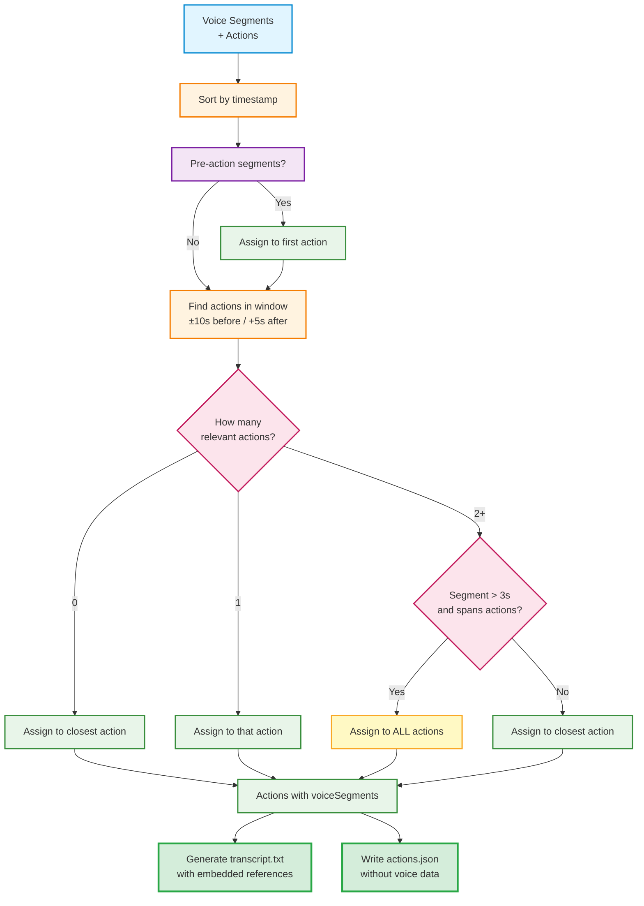
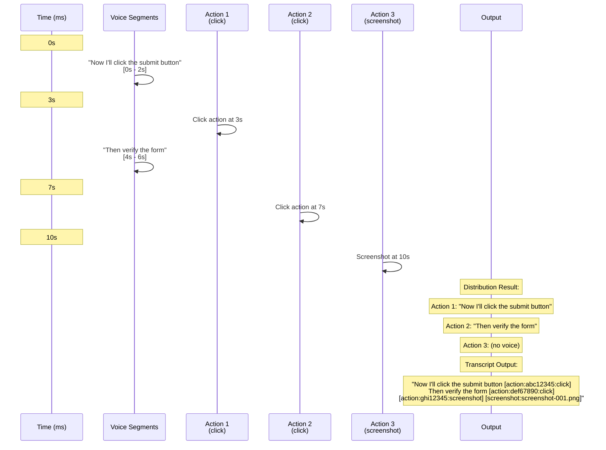

# Voice Transcription System

## Overview

Dodo Recorder uses OpenAI's Whisper model (via whisper.cpp) to transcribe voice commentary during browser recording sessions. The transcription runs locally for privacy and produces timestamped segments that are intelligently distributed across recorded actions.

## How It Works

### 1. Audio Capture
- Uses Web Audio API via `MediaRecorder` in the renderer process
- Records in WebM format with Opus codec at 16kHz (Whisper's native sample rate)
- Audio chunks collected every second during recording
- Synchronized with browser action timestamps using a shared `startTime` reference

### 2. Audio Processing Pipeline

When recording stops, the audio goes through this pipeline:

```
WebM Audio Buffer
    ↓
FFmpeg Conversion (16kHz mono WAV + 1.5s silence padding)
    ↓
Whisper.cpp Transcription (direct CLI call with optimized parameters)
    ↓
JSON Output Parsing
    ↓
Timestamp Offset Correction (-1500ms to account for padding)
    ↓
Timestamped Transcript Segments
```

### 3. Voice Distribution Algorithm

Transcript segments are intelligently associated with browser actions:
- **Lookback window**: 10 seconds before each action
- **Lookahead window**: 5 seconds after each action
- **Overlap handling**: Long commentary spanning multiple actions is distributed appropriately
- **Multi-action assignment**: Segments longer than 3 seconds that span multiple actions are assigned to ALL relevant actions
- **Pre-action capture**: Speech before the first action is preserved (assigned to first action)
- **Closest action fallback**: Segments outside all action windows are assigned to the temporally closest action

## Key Implementation Details

### Direct Whisper.cpp Integration

**Problem Solved**: Previous integrations using npm wrappers were limited or buggy.

**Solution**: We bundle and call `whisper.cpp` directly with full parameter control:

```typescript
// Direct command execution with all parameters
const command = [
  whisperMainPath,
  '-m', modelPath,
  '-f', audioPath,
  '-l', 'en',
  '-oj',              // Output JSON
  '-ml', '0',         // No max length
  '-sow',             // Split on word boundaries
  '-bo', '5',         // Best of 5 candidates
  '-bs', '5',         // Beam size 5
  '-et', '2.0',       // Entropy threshold (critical for early detection)
  '-lpt', '-1.0',     // Log probability threshold
  '--prompt', '"..."' // Context priming
].join(' ')
```

### Silence Padding Technique

**Why**: Whisper's Voice Activity Detection (VAD) tends to miss the first few seconds of audio, especially when speech starts immediately.

**Solution**: Add 1.5 seconds of silence at the beginning using FFmpeg filters:

```typescript
.audioFilters([
  'apad=pad_dur=1.5',  // Add padding at end
  'areverse',           // Reverse audio
  'apad=pad_dur=1.5',  // Add padding (now at beginning after reverse)
  'areverse'            // Reverse back to original
])
```

Then subtract 1500ms from all Whisper timestamps to realign with actual recording timeline.

### Critical Whisper Parameters

| Parameter | Value | Purpose |
|-----------|-------|---------|
| `-et` (entropy_threshold) | `2.0` | **Most important** - Lower value = more aggressive speech detection at beginning |
| `-bo` (best_of) | `5` | Use best of 5 beam search candidates |
| `-bs` (beam_size) | `5` | Beam search width for better accuracy |
| `-ml` (max_len) | `0` | No length limit on segments |
| `-sow` (split_on_word) | flag | Split on word boundaries, not tokens |
| `--prompt` | context string | Prime model with expected vocabulary |

## Whisper Model

### Bundled Model: small.en

Dodo Recorder uses the **small.en** model exclusively, bundled with the application.

**Download Model (Required for Development):**

```bash
# Download to models/ folder in project root
curl -L -o models/ggml-small.en.bin https://huggingface.co/ggerganov/whisper.cpp/resolve/main/ggml-small.en.bin
```

**Characteristics:**
- Size: 466 MB disk, ~1.0 GB RAM
- Quality: Better accuracy, especially for technical terms
- Speed: Medium (acceptable for real-time use)
- Captures early speech reliably with optimized parameters

### Model Location

The model is stored in the `models/` folder:
```
dodo-recorder/
├── models/
│   ├── whisper              # Whisper.cpp binary (committed to git)
│   └── ggml-small.en.bin    # AI model weights (download manually, gitignored)
└── ...
```

**Note:** The model file (`.bin`) is gitignored. Developers must manually download it once. The binary is committed to git.

## Output Format

### transcript.txt (Primary Output)

This is the main transcript file that combines voice commentary with embedded action references. It's optimized for both LLM consumption (for generating Playwright tests) and human readability.

**Format:**
- Natural voice transcription flow
- Action references: `[action:SHORT_ID:TYPE]`
- Screenshot references for screenshot actions: `[screenshot:FILENAME]`
- ALL actions are referenced in the transcript
- Includes an action reference table at the end

**Example:**
```
# Recording Session Transcript

This transcript combines voice commentary with action and screenshot references.
Format: [action:ID:TYPE] for actions, [screenshot:FILENAME] for screenshots.

## Narrative

So, this is the test session. The browser just opened and the URL was visited
[action:e6c3069a:navigate]. Now I'm clicking on some top menu items
[action:c5922be3:click] [action:72e42724:click] to assert them, to assert my
name [action:2e185707:assert]. In the hero section, to assert the button is
here [action:3ea1708c:assert]. Taking a screenshot now
[action:4a62c1b8:screenshot] [screenshot:screenshot-001.png]. Clicking the
LinkedIn button [action:ef955889:click]...

## Action Reference

| Action ID | Type | Timestamp | Target |
|-----------|------|-----------|--------|
| e6c3069a | navigate | 00:00 | https://example.com |
| c5922be3 | click | 00:03 | Home |
| 72e42724 | click | 00:04 | Projects |
| 2e185707 | assert | 00:05 | John Doe |
| 3ea1708c | assert | 00:06 | Submit |
| 4a62c1b8 | screenshot | 00:08 | - |
| ef955889 | click | 00:09 | LinkedIn |
...
```

## Troubleshooting

### Issue: Missing Beginning of Recording

**Symptoms**: First 5-15 seconds of speech not transcribed

**Causes & Solutions**:
1. **Entropy threshold too high** → Lowered to 2.0 (from default 2.4)
2. **No silence padding** → Added 1.5s padding before audio
3. **Using whisper-node wrapper** → Switched to direct whisper.cpp calls

### Issue: Poor Recognition of Technical Terms

**Symptoms**: "LinkedIn" transcribed as "link a theme", "GitHub" as "get hub"

**Solutions**:
1. **Upgraded model** → Changed from base.en to small.en
2. **Added initial prompt** → Primes model with expected vocabulary:
   ```
   "This is a recording session with browser interactions, clicking, 
   navigation, menu items, LinkedIn, GitHub, scrolling."
   ```

### Issue: Transcription Takes Too Long

**Solutions**:
1. Use smaller model (base.en or tiny.en)
2. Reduce audio quality (already optimized at 16kHz mono)
3. Check CPU usage - Whisper is CPU-intensive

### Issue: No Transcription Output

**Check**:
1. Model file exists: `models/ggml-small.en.bin` (in project root)
2. If model is missing, download it: `curl -L -o models/ggml-small.en.bin https://huggingface.co/ggerganov/whisper.cpp/resolve/main/ggml-small.en.bin`
3. FFmpeg is working: Check logs for conversion errors
4. Microphone permissions granted
5. Audio chunks were recorded (check console logs)

## Performance Characteristics

### Transcription Speed
- **small.en**: ~2-3x real-time (10 second audio → 3-5 seconds to transcribe)
- **base.en**: ~1-2x real-time
- **medium.en**: ~4-6x real-time

### Memory Usage
- **Idle**: ~200 MB
- **Recording**: +100 MB (audio buffering)
- **Transcribing (small.en)**: +1.0 GB (model loaded)
- **Peak**: ~1.5 GB total

### Disk Space
- Model: 466 MB (small.en)
- Per session: ~100-500 KB audio (depends on duration)
- Temporary files: Cleaned up automatically

## Voice Distribution Flow



### Example Scenario



## Architecture

### File Structure
```
electron/audio/
├── transcriber.ts             # Main transcription logic
electron/utils/
├── voiceDistribution.ts       # Algorithm for associating voice with actions
├── enhancedTranscript.ts      # Transcript generation with embedded references
src/components/
├── RecordingControls.tsx      # Audio capture in renderer
electron/ipc/
├── recording.ts               # IPC handlers for recording and transcription
└── session.ts                 # IPC handlers for session saving
```

### Key Classes

**Transcriber** ([`electron/audio/transcriber.ts`](../electron/audio/transcriber.ts))
- Initializes Whisper model
- Converts audio formats (WebM → WAV)
- Executes whisper.cpp with optimized parameters
- Parses JSON output and adjusts timestamps

**Voice Distribution** ([`electron/utils/voiceDistribution.ts`](../electron/utils/voiceDistribution.ts))
- Temporal proximity algorithm
- Handles overlapping segments
- Preserves pre-action commentary
- Configurable time windows via settings

**Enhanced Transcript Generator** ([`electron/utils/enhancedTranscript.ts`](../electron/utils/enhancedTranscript.ts))
- Generates transcript.txt with embedded action references
- Handles actions with and without voice commentary
- Creates action reference table for quick lookup

## Privacy & Security

- **100% Local Processing**: No audio sent to cloud services
- **No API Keys Required**: Whisper runs entirely on your machine
- **Offline Capable**: Works without internet connection
- **Data Retention**: Audio files deleted after transcription (only text kept)

## Future Enhancements

Potential improvements:
1. **Real-time transcription**: Stream transcription during recording
2. **Speaker diarization**: Identify multiple speakers
3. **Custom vocabulary**: User-defined technical terms
4. **Multi-language support**: Beyond English
5. **GPU acceleration**: Faster transcription with CUDA/Metal
6. **Confidence scores**: Show transcription confidence per segment

## References

- [Whisper.cpp GitHub](https://github.com/ggerganov/whisper.cpp)
- [OpenAI Whisper Paper](https://arxiv.org/abs/2212.04356)
- [Whisper Model Cards](https://github.com/openai/whisper/blob/main/model-card.md)
- [GGML Format Documentation](https://github.com/ggerganov/ggml)

## Key Files

- [`electron/audio/transcriber.ts`](../electron/audio/transcriber.ts) - Core transcription with direct whisper.cpp calls
- [`electron/utils/voiceDistribution.ts`](../electron/utils/voiceDistribution.ts) - Voice-to-action association
- [`electron/utils/enhancedTranscript.ts`](../electron/utils/enhancedTranscript.ts) - Transcript generation with embedded references
- [`electron/ipc/recording.ts`](../electron/ipc/recording.ts) - IPC handlers for transcription
- [`electron/settings/store.ts`](../electron/settings/store.ts) - Whisper model configuration
- [`src/components/RecordingControls.tsx`](../src/components/RecordingControls.tsx) - Audio capture in renderer
