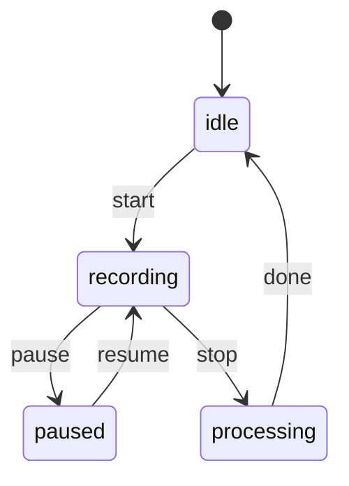

# Pause/Resume Recording Plan

## Goals and Semantics
- Pause stops action capture and voice capture immediately.
- While paused, all browser-widget actions are disabled and ignored.
- Elapsed time excludes paused duration.
- Resume continues the same session timeline from the moment of pause.
- Stop recording remains app-only (browser widget does not stop recordings).

## Design Overview

### 1) IPC + State Sync
- Add pause/resume handlers in [`registerRecordingHandlers`](electron/ipc/recording.ts:25).
- Emit a single main-to-renderer event (e.g., `recording-state-changed`) so the app UI syncs when pause/resume is triggered from the browser widget.
- Extend the preload bridge and renderer types in [`ElectronAPI`](electron/preload.ts:41) and [`ElectronAPI`](src/types/electron.d.ts:22) with:
  - `pauseRecording()`
  - `resumeRecording()`
  - `onRecordingStateChanged()`

### 2) Main Process Timing Model
- Extend [`BrowserRecorder`](electron/browser/recorder.ts:88) with:
  - `isPaused: boolean`
  - `pauseStartedAt: number | null`
  - `pausedDurationMs: number`
- Centralize timestamp math so both [`recordAction`](electron/browser/recorder.ts:277) and [`captureScreenshot`](electron/browser/recorder.ts:256) use:
  - `effectiveElapsedMs = now - startTime - pausedDurationMs`
- Expose page functions via `page.exposeFunction`:
  - `__dodoPauseRecording` and `__dodoResumeRecording`
- Push `window.__dodoRecordingPaused` to page context so injected script + widget can gate behavior.

### 3) Injected Script Guardrails
- In [`getInjectionScript`](electron/browser/injected-script.ts:13), gate all event listeners on `window.__dodoRecordingPaused`.
- Block keyboard screenshot shortcut while paused.

### 4) Renderer UI + Audio
- Extend store in [`useRecordingStore`](src/stores/recordingStore.ts:66) with:
  - `pausedAt` and `pausedDurationMs`
- Update [`RecordingControls`](src/components/RecordingControls.tsx:11) to:
  - Render Pause/Resume button next to Stop.
  - Call IPC pause/resume.
  - Call `MediaRecorder.pause()` / `MediaRecorder.resume()`.
  - Update audio activity indicator via `updateAudioActivity(false|true)`.
  - Subscribe to `onRecordingStateChanged()` for widget-initiated pause/resume.
- Update elapsed timer logic in [`StatusBar`](src/components/StatusBar.tsx:15) to:
  - Freeze during pause.
  - Subtract `pausedDurationMs` from elapsed time.

### 5) Browser Widget UI
- Extend [`getWidgetScript`](electron/browser/recording-widget.ts:12) to add a Pause/Play button.
- When paused:
  - Disable screenshot/assert buttons.
  - Show Play (resume) icon.
  - Call `__dodoPauseRecording` / `__dodoResumeRecording`.

### 6) Documentation Updates
- Update pause/resume behavior, UI locations, and timing semantics in:
  - [`docs/browser_widget.md`](docs/browser_widget.md)
  - [`docs/application_ui.md`](docs/application_ui.md)
  - [`docs/architecture.md`](docs/architecture.md)
  - [`docs/voice_transcription.md`](docs/voice_transcription.md)
  - [`docs/user_guide.md`](docs/user_guide.md)
  - [`README.md`](README.md)

## State Flow

## Edge Cases / Safeguards
- Ignore redundant pause/resume calls based on `isPaused`.
- If browser page reloads, re-apply `__dodoRecordingPaused` and audio activity state.
- Ensure actions and audio timelines remain aligned by excluding paused duration on both sides.
- Stop recording resets pause state and clears timers.
