# Pause/Resume Voice Recording Bug - Root Cause Analysis

## Problem Statement

When recording is paused via the browser widget pause button, browser actions stop being recorded (✅ working), but voice recording continues (❌ bug). The paused audio chunks still get included in the final transcription.

---

## Root Cause Analysis

### Current Flow - Browser Widget Pause


### Current Flow - App UI Pause (Would work correctly)

```mermaid
sequenceDiagram
    participant UI as App UI Button
    participant IPC as IPC Handler
    participant Recorder as BrowserRecorder
    participant Renderer as RecordingControls

    UI->>IPC: pause-recording IPC call
    IPC->>Recorder: browserRecorder.pause()
    Recorder->>Recorder: isPaused = true
    IPC->>Renderer: recording-state-changed event
    Renderer->>Renderer: MediaRecorder.pause()
    Note over Renderer: ✅ Audio paused
```



### The Bug

**File:** [`electron/browser/recorder.ts:216-230`](../electron/browser/recorder.ts:216-230)

```typescript
// Expose pause/resume functions to browser context
await this.page.exposeFunction('__dodoPauseRecording', async () => {
  try {
    await this.pause()  // ❌ Calls pause but doesn't notify renderer!
  } catch (e) {
    logger.error('Failed to pause recording:', e)
  }
})

await this.page.exposeFunction('__dodoResumeRecording', async () => {
  try {
    await this.resume()  // ❌ Calls resume but doesn't notify renderer!
  } catch (e) {
    logger.error('Failed to resume recording:', e)
  }
})
```

**The exposed functions call `pause()/resume()` directly, bypassing the IPC handler that emits the `recording-state-changed` event to the renderer.**

**File:** [`electron/ipc/recording.ts:99-127`](../electron/ipc/recording.ts:99-127)

```typescript
ipcMain.handle('pause-recording', async () => {
  // ... validation ...
  return handleIpc(async () => {
    await browserRecorder!.pause()
    // ✅ Sends event to renderer
    if (mainWindow && !mainWindow.isDestroyed() && mainWindow.webContents && !mainWindow.webContents.isDestroyed()) {
      mainWindow.webContents.send('recording-state-changed', { status: 'paused' })
    }
    return {}
  }, 'Failed to pause recording')
})
```

**The IPC handler DOES send the event, but it's only triggered when pause is called from the app UI, not from the browser widget.**

---

## Impact Assessment

### What Works
- ✅ Actions stop being recorded while paused
- ✅ Screenshots blocked while paused
- ✅ Assertion mode blocked while paused
- ✅ Keyboard shortcuts blocked while paused
- ✅ Elapsed time excludes paused duration
- ✅ Widget UI updates correctly

### What's Broken
- ❌ **MediaRecorder continues recording audio during pause**
- ❌ **Paused audio chunks get transcribed by Whisper**
- ❌ **Voice segments include speech during paused periods**
- ❌ **Timeline misalignment between actions and voice**

### Why This Matters

1. **Privacy**: User expects microphone to stop during pause
2. **Data accuracy**: Paused commentary pollutes the transcript
3. **Timeline integrity**: Voice segments don't align with action timestamps
4. **User trust**: Behavior doesn't match UI (widget shows paused, but audio indicator might be visible)

---

## Solution Architecture

### Option 1: BrowserRecorder Emits Events (RECOMMENDED)

Make `BrowserRecorder` emit `pause` and `resume` events, and have IPC handlers listen and forward to renderer.

**Advantages:**
- Single source of truth for pause/resume state
- Works consistently whether triggered from widget or app UI
- Clean separation of concerns
- EventEmitter pattern already in use

**Changes required:**
1. `BrowserRecorder.pause()` emits `'paused'` event
2. `BrowserRecorder.resume()` emits `'resumed'` event
3. IPC registration listens to these events and forwards to renderer

### Option 2: Pass mainWindow to BrowserRecorder

Pass `mainWindow` reference to `BrowserRecorder` constructor and have it send IPC events directly.

**Disadvantages:**
- Tight coupling between recorder and IPC
- Violates separation of concerns
- Harder to test

### Option 3: Exposed Functions Call IPC Handlers

Make exposed functions call the IPC handlers instead of calling methods directly.

**Disadvantages:**
- Circular dependency issues
- More complex flow
- Harder to debug

---

## Recommended Solution: Event-Driven Architecture

### Implementation Plan

#### 1. Update BrowserRecorder to emit events

**File:** `electron/browser/recorder.ts`

```typescript
export class BrowserRecorder extends EventEmitter {
  // ... existing code ...

  async pause(): Promise<void> {
    if (!this.page || this.isPaused) {
      logger.debug('Cannot pause - already paused or no page')
      return
    }

    this.isPaused = true
    this.pauseStartedAt = Date.now()
    
    logger.info('🔶 Recording paused')

    try {
      // Update browser widget UI
      await this.page.evaluate(() => {
        // ... existing UI update code ...
      })
    } catch (error) {
      logger.error('Failed to update pause state in browser:', error)
    }

    // ✅ NEW: Emit event for IPC handler to forward
    this.emit('paused')
  }

  async resume(): Promise<void> {
    if (!this.page || !this.isPaused) {
      logger.debug('Cannot resume - not paused or no page')
      return
    }

    // Accumulate paused duration
    if (this.pauseStartedAt !== null) {
      this.pausedDurationMs += Date.now() - this.pauseStartedAt
      this.pauseStartedAt = null
    }

    this.isPaused = false
    
    logger.info('▶️ Recording resumed')

    try {
      // Update browser widget UI
      await this.page.evaluate((audioActive: boolean) => {
        // ... existing UI update code ...
      }, this.audioActive)
    } catch (error) {
      logger.error('Failed to update resume state in browser:', error)
    }

    // ✅ NEW: Emit event for IPC handler to forward
    this.emit('resumed')
  }
}
```

#### 2. Update IPC handlers to listen for events

**File:** `electron/ipc/recording.ts`

```typescript
export function registerRecordingHandlers(mainWindow: BrowserWindow | null) {
  ipcMain.handle('start-recording', async (_, startUrl: string, outputPath: string, startTime: number) => {
    // ... existing validation ...

    return handleIpc(async () => {
      isRecording = true
      
      try {
        // ... existing setup code ...

        browserRecorder = new BrowserRecorder()
        
        // ✅ NEW: Listen for pause/resume events and forward to renderer
        browserRecorder.on('paused', () => {
          if (mainWindow && !mainWindow.isDestroyed() && mainWindow.webContents && !mainWindow.webContents.isDestroyed()) {
            mainWindow.webContents.send('recording-state-changed', { status: 'paused' })
            logger.debug('Forwarded paused event to renderer')
          }
        })

        browserRecorder.on('resumed', () => {
          if (mainWindow && !mainWindow.isDestroyed() && mainWindow.webContents && !mainWindow.webContents.isDestroyed()) {
            mainWindow.webContents.send('recording-state-changed', { status: 'recording' })
            logger.debug('Forwarded resumed event to renderer')
          }
        })

        browserRecorder.on('action', (action) => {
          // ... existing action forwarding ...
        })

        await browserRecorder.start(startUrl, screenshotDir)
        // ... rest of setup ...

        return {}
      } catch (error) {
        // ... existing error handling ...
      }
    }, 'Failed to start recording')
  })

  // IPC handlers for app UI pause/resume - now just proxies
  ipcMain.handle('pause-recording', async () => {
    if (!isRecording || !browserRecorder) {
      return ipcError('No recording in progress')
    }

    return handleIpc(async () => {
      await browserRecorder!.pause()
      // Event forwarding now handled by event listener above
      return {}
    }, 'Failed to pause recording')
  })

  ipcMain.handle('resume-recording', async () => {
    if (!isRecording || !browserRecorder) {
      return ipcError('No recording in progress')
    }

    return handleIpc(async () => {
      await browserRecorder!.resume()
      // Event forwarding now handled by event listener above
      return {}
    }, 'Failed to resume recording')
  })

  // ... rest of handlers ...
}
```

#### 3. Renderer already handles the event correctly

**File:** `src/components/RecordingControls.tsx:68-100`

```typescript
// Listen for pause/resume state changes from browser widget
useEffect(() => {
  if (!window.electronAPI) return
  const unsubscribe = window.electronAPI.onRecordingStateChanged((data) => {
    console.log('🔔 Recording state changed from widget:', data.status)
    setStatus(data.status)
    
    if (data.status === 'paused') {
      setPausedAt(Date.now())
      // ✅ This WILL now be called when widget triggers pause
      if (mediaRecorderRef.current && mediaRecorderRef.current.state === 'recording') {
        mediaRecorderRef.current.pause()
        console.log('🎤 Audio recording paused')
      }
      setAudioActive(false)
    } else if (data.status === 'recording') {
      // ... resume logic ...
      if (mediaRecorderRef.current && mediaRecorderRef.current.state === 'paused') {
        mediaRecorderRef.current.resume()
        console.log('🎤 Audio recording resumed')
      }
      if (isVoiceEnabled) {
        setAudioActive(true)
      }
    }
  })
  return unsubscribe
}, [setStatus, setPausedAt, setPausedDuration, pausedAt, pausedDurationMs, isVoiceEnabled])
```

**This code is already correct! It just wasn't being triggered when pause came from the widget.**

---

## Timeline Alignment Verification

### Current Behavior (Working)

Both actions and audio use the same `startTime`:

**Actions:** `effectiveElapsedMs = now - startTime - pausedDurationMs` ([`recorder.ts:307`](../electron/browser/recorder.ts:307))

**Audio:** Chunks collected by MediaRecorder with `startTime` from renderer ([`RecordingControls.tsx:149-150`](../src/components/RecordingControls.tsx:149-150))

### After Fix

With MediaRecorder properly paused:
1. **During pause**: No audio chunks recorded (MediaRecorder.pause())
2. **On resume**: MediaRecorder.resume() continues from where it left off
3. **Transcription**: Only active recording periods transcribed
4. **Distribution**: Voice segments aligned with actions (both exclude paused time)

**Timeline integrity maintained** ✅

---

## Testing Checklist

### Manual Testing

- [ ] Start recording with voice enabled
- [ ] Speak a few words
- [ ] Click pause in browser widget
- [ ] Verify voice indicator disappears
- [ ] Speak while paused (should NOT be recorded)
- [ ] Click resume in browser widget
- [ ] Speak a few more words
- [ ] Stop recording
- [ ] Verify transcript only contains pre-pause and post-pause speech
- [ ] Verify NO speech from paused period

### Edge Cases

- [ ] Pause → immediate resume
- [ ] Multiple pause/resume cycles
- [ ] Pause → stop recording (no resume)
- [ ] Pause with no voice enabled
- [ ] Pause during silent periods
- [ ] Page navigation while paused

---

## Documentation Updates

### Files to Update

1. [`pause_resume_plan.md`](../pause_resume_plan.md) - Mark as implemented
2. [`docs/browser_widget.md`](../docs/browser_widget.md) - Update pause behavior description
3. [`docs/voice_transcription.md`](../docs/voice_transcription.md) - Document pause behavior in pipeline
4. [`docs/architecture.md`](../docs/architecture.md) - Update pause/resume flow diagrams
5. [`CHANGELOG.md`](../CHANGELOG.md) - Add bug fix entry

---

## Risk Assessment

### Low Risk

- Event-driven pattern already used extensively (`'action'` events)
- Renderer code already correct, just needs events
- No changes to timeline calculation logic
- No changes to voice distribution algorithm

### Potential Issues

1. **Event listener cleanup**: Ensure listeners removed on stop
2. **Race conditions**: Multiple rapid pause/resume clicks
3. **Window closure**: Check event emission when window closed

### Mitigation

- Remove event listeners in `stop()` method
- Guard with `isPaused` checks (already present)
- Guard event emission with window validity checks (already present in IPC handlers)

---

## Alternative: Stop MediaRecorder Instead of Pause

### Consideration

Instead of `MediaRecorder.pause()`, we could stop and restart it. However:

**Disadvantages:**
- More complex state management
- Need to merge multiple audio blobs
- Potential audio quality issues at boundaries
- More code changes required

**Current approach (pause/resume) is simpler and more reliable.**

---

## Summary

**Root Cause:** Browser widget pause calls `BrowserRecorder.pause()` directly without notifying renderer, so MediaRecorder continues recording.

**Solution:** Make `BrowserRecorder` emit `'paused'` and `'resumed'` events that IPC handlers forward to renderer.

**Impact:** Minimal code changes, leverages existing event infrastructure, maintains timeline integrity.

**Testing:** Simple manual verification - speak during pause, should not appear in transcript.
