# Pause/Resume Voice Recording Bug - Solution Summary

## Executive Summary

**Bug:** When pausing recording via the browser widget, actions stop being recorded (✅) but voice continues recording (❌). This causes paused audio to be transcribed and included in the final session.

**Root Cause:** Browser widget's pause button calls [`BrowserRecorder.pause()`](../electron/browser/recorder.ts:371) directly without notifying the renderer process, so [`MediaRecorder`](../src/components/RecordingControls.tsx:238) continues recording audio chunks.

**Solution:** Implement event-driven architecture where `BrowserRecorder` emits `'paused'` and `'resumed'` events that IPC handlers forward to the renderer process to control MediaRecorder.

**Complexity:** Low - Only ~14 net new lines of code, leveraging existing EventEmitter infrastructure.

**Risk:** Low - Minimal changes, no modifications to timeline logic or voice distribution.

---

## Current vs Fixed Flow Diagrams

### Current Broken Flow (Browser Widget Pause)


### Fixed Flow (Event-Driven)

```mermaid
sequenceDiagram
    participant User
    participant Widget as Browser Widget
    participant Recorder as BrowserRecorder
    participant IPC as IPC Handler
    participant Renderer as RecordingControls
    participant MediaRec as MediaRecorder

    User->>Widget: Click Pause
    Widget->>Recorder: __dodoPauseRecording()
    Recorder->>Recorder: isPaused = true
    Recorder->>Recorder: emit('paused') ✅
    Note over Recorder: Actions blocked
    
    Recorder->>IPC: 'paused' event
    IPC->>Renderer: recording-state-changed
    Renderer->>MediaRec: pause() ✅
    Renderer->>Renderer: setAudioActive(false)
    
    Note over MediaRec: ✅ Paused!
    User->>User: Speaks during pause
    Note over MediaRec: No chunks recorded ✅
    
    User->>Widget: Click Resume
    Widget->>Recorder: __dodoResumeRecording()
    Recorder->>Recorder: isPaused = false
    Recorder->>Recorder: emit('resumed') ✅
    
    Recorder->>IPC: 'resumed' event
    IPC->>Renderer: recording-state-changed
    Renderer->>MediaRec: resume() ✅
    Renderer->>Renderer: setAudioActive(true)
    
    Note over MediaRec: ✅ Recording again!
```



---

## Timeline Integrity

### How Timestamps Work

Both actions and voice use the same `startTime` from the renderer:

```typescript
// RecordingControls.tsx:149
const recordingStartTime = Date.now()
setStartTime(recordingStartTime)

// Actions: effectiveElapsedMs = now - startTime - pausedDurationMs
// Voice: MediaRecorder chunks aligned to same startTime
```

### Before Fix (BROKEN)

```
Timeline:  0s -------- 5s -------- 10s ------- 15s ------- 20s
Actions:   [navigate] [click]  PAUSED      [click]     [fill]
Voice:     "Starting" "Click"  "GARBAGE"   "Resume"    "Done"
                                   ↑
                              SHOULD NOT BE HERE!
```

### After Fix (CORRECT)

```
Timeline:  0s -------- 5s -------- 10s ------- 15s ------- 20s
Actions:   [navigate] [click]  PAUSED      [click]     [fill]
Voice:     "Starting" "Click"  <silence>   "Resume"    "Done"
                                   ↑
                          NO AUDIO CHUNKS RECORDED ✅
```

**Key Point:** With MediaRecorder properly paused, no chunks are created during paused periods, so transcription naturally excludes that time. The [`pausedDurationMs`](../electron/browser/recorder.ts:102) adjustment in action timestamps ensures perfect alignment.

---

## Code Changes Overview

### 1. BrowserRecorder Emits Events

**File:** [`electron/browser/recorder.ts`](../electron/browser/recorder.ts)

```typescript
// In pause() method (after UI update)
async pause(): Promise<void> {
  // ... existing pause logic ...
  
  // ✅ NEW: Notify IPC handlers
  this.emit('paused')
}

// In resume() method (after UI update)
async resume(): Promise<void> {
  // ... existing resume logic ...
  
  // ✅ NEW: Notify IPC handlers
  this.emit('resumed')
}

// In stop() method (cleanup)
async stop(): Promise<void> {
  // ... existing cleanup ...
  
  // ✅ NEW: Remove listeners
  this.removeAllListeners('paused')
  this.removeAllListeners('resumed')
}
```

### 2. IPC Handlers Forward Events

**File:** [`electron/ipc/recording.ts`](../electron/ipc/recording.ts)

```typescript
// In start-recording handler (after action listener)
browserRecorder.on('paused', () => {
  if (mainWindow && !mainWindow.isDestroyed() && mainWindow.webContents && !mainWindow.webContents.isDestroyed()) {
    mainWindow.webContents.send('recording-state-changed', { status: 'paused' })
    logger.debug('🔶 Forwarded paused event to renderer')
  }
})

browserRecorder.on('resumed', () => {
  if (mainWindow && !mainWindow.isDestroyed() && mainWindow.webContents && !mainWindow.webContents.isDestroyed()) {
    mainWindow.webContents.send('recording-state-changed', { status: 'recording' })
    logger.debug('▶️ Forwarded resumed event to renderer')
  }
})

// In pause-recording and resume-recording handlers
// Remove the mainWindow.webContents.send() calls
// (now handled by event listeners above)
```

### 3. Renderer Already Correct

**File:** [`src/components/RecordingControls.tsx`](../src/components/RecordingControls.tsx:68-100)

```typescript
// This code is already correct - it just wasn't being triggered!
useEffect(() => {
  const unsubscribe = window.electronAPI.onRecordingStateChanged((data) => {
    if (data.status === 'paused') {
      // ✅ This will now be called when widget triggers pause
      if (mediaRecorderRef.current?.state === 'recording') {
        mediaRecorderRef.current.pause()
        console.log('🎤 Audio recording paused')
      }
    } else if (data.status === 'recording') {
      // ✅ This will now be called when widget triggers resume
      if (mediaRecorderRef.current?.state === 'paused') {
        mediaRecorderRef.current.resume()
        console.log('🎤 Audio recording resumed')
      }
    }
  })
  return unsubscribe
}, [/* deps */])
```

---

## Why This Solution Works

### 1. Single Source of Truth

`BrowserRecorder` is the authority on pause/resume state. Whether triggered from:
- Browser widget → exposed function → `pause()` → emit event
- App UI → IPC handler → `pause()` → emit event

Both paths converge on the same `pause()` method, ensuring consistent behavior.

### 2. Consistent Event Flow

```
ANY TRIGGER → BrowserRecorder.pause() → emit('paused')
                                         ↓
                                    IPC Handler listens
                                         ↓
                                    Forward to renderer
                                         ↓
                                    MediaRecorder.pause()
```

### 3. Existing Infrastructure

- `BrowserRecorder extends EventEmitter` - already in place
- `browserRecorder.on('action', ...)` - pattern already used
- `mainWindow.webContents.send()` - already used for action forwarding
- `onRecordingStateChanged()` - already implemented in renderer

**We're just adding two more events to an existing, proven pattern.**

### 4. Minimal Risk

- No changes to timestamp calculations
- No changes to voice distribution algorithm
- No changes to MediaRecorder initialization
- No changes to transcription pipeline

**Only changes:** Event emission and listener registration.

---

## Verification Strategy

### Console Log Trace (Expected Output)

```
🎬 startRecording() called
🎤 Microphone stream acquired
🎤 Audio recording started at: 1234567890
🌐 Starting browser recording...
✅ Recording started successfully

[User clicks pause in widget]
🔶 Recording paused
🔶 Forwarded paused event to renderer
🔔 Recording state changed from widget: paused
🎤 Audio recording paused

[User speaks - should NOT be recorded]
[No audio chunks logged]

[User clicks resume in widget]
▶️ Recording resumed (paused for 5000ms total)
▶️ Forwarded resumed event to renderer
🔔 Recording state changed from widget: recording
🎤 Audio recording resumed

[User stops recording]
🎤 Audio Recording Summary
Total audio chunks: 15  ← Should NOT include paused period
```

### MediaRecorder State Verification

In Chrome DevTools during recording:

```javascript
// While recording
mediaRecorderRef.current.state === 'recording'  // true

// After pause
mediaRecorderRef.current.state === 'paused'     // true ✅ (was 'recording' ❌)

// After resume
mediaRecorderRef.current.state === 'recording'  // true
```

---

## Testing Scenarios

### Scenario 1: Basic Widget Pause

| Step | Action | Expected Behavior |
|------|--------|-------------------|
| 1 | Start recording + speak "start" | Voice indicator shows, audio recorded |
| 2 | Click pause in widget | Voice indicator hides, actions disabled |
| 3 | Speak "paused speech" | NO audio chunks created |
| 4 | Click resume in widget | Voice indicator shows, actions enabled |
| 5 | Speak "end" | Audio recorded again |
| 6 | Stop recording | Transcript: "start" + "end" (NO "paused speech") |

### Scenario 2: App UI Pause (Regression Test)

Same as Scenario 1, but use app UI pause button instead of widget button. Should work identically.

### Scenario 3: Multiple Pause/Resume Cycles

```
speak("one") → pause → speak("X") → resume → speak("two") → pause → speak("Y") → resume → speak("three")

Expected transcript: "one two three"
NOT: "one X two Y three"
```

### Scenario 4: Edge Cases

- Rapid pause/resume clicks (state should remain consistent)
- Pause immediately after start (before any speech)
- Page navigation while paused (state should be maintained)
- Stop recording while paused (should work normally)

---

## Implementation Checklist

**Code Changes:**
- [ ] Add `this.emit('paused')` to [`BrowserRecorder.pause()`](../electron/browser/recorder.ts:371)
- [ ] Add `this.emit('resumed')` to [`BrowserRecorder.resume()`](../electron/browser/recorder.ts:431)
- [ ] Add event listeners in [`start-recording` IPC handler](../electron/ipc/recording.ts:62)
- [ ] Remove redundant `mainWindow.webContents.send()` from [`pause-recording` handler](../electron/ipc/recording.ts:107)
- [ ] Remove redundant `mainWindow.webContents.send()` from [`resume-recording` handler](../electron/ipc/recording.ts:122)
- [ ] Add `removeAllListeners()` calls in [`BrowserRecorder.stop()`](../electron/browser/recorder.ts:504)

**Testing:**
- [ ] Test widget pause/resume with voice
- [ ] Test app UI pause/resume with voice
- [ ] Verify console logs show correct event flow
- [ ] Verify MediaRecorder state transitions
- [ ] Verify transcript excludes paused speech
- [ ] Test edge cases (rapid clicks, navigation, etc.)

**Documentation:**
- [ ] Update [`docs/browser_widget.md`](../docs/browser_widget.md) - Pause behavior
- [ ] Update [`docs/voice_transcription.md`](../docs/voice_transcription.md) - Pause in pipeline
- [ ] Update [`docs/architecture.md`](../docs/architecture.md) - Event flow diagrams
- [ ] Mark [`pause_resume_plan.md`](../pause_resume_plan.md) as fully implemented
- [ ] Add entry to [`CHANGELOG.md`](../CHANGELOG.md)

---

## Files Modified

| File | Changes | Purpose |
|------|---------|---------|
| [`electron/browser/recorder.ts`](../electron/browser/recorder.ts) | +4 lines | Emit pause/resume events |
| [`electron/ipc/recording.ts`](../electron/ipc/recording.ts) | +18, -8 lines | Listen and forward events |
| **Total** | **~14 net new lines** | Event-driven sync |

---

## Alternative Solutions Considered

### ❌ Option A: Pass mainWindow to BrowserRecorder

```typescript
class BrowserRecorder {
  constructor(private mainWindow: BrowserWindow) {}
  
  async pause() {
    // ... pause logic ...
    this.mainWindow.webContents.send('recording-state-changed', { status: 'paused' })
  }
}
```

**Rejected:** Tight coupling, violates separation of concerns, harder to test.

### ❌ Option B: Exposed Functions Call IPC Handlers

```typescript
await this.page.exposeFunction('__dodoPauseRecording', async () => {
  ipcMain.emit('pause-recording', ...)  // Call IPC handler
})
```

**Rejected:** Circular dependency, more complex, harder to debug.

### ✅ Option C: Event-Driven (CHOSEN)

**Advantages:**
- Leverages existing EventEmitter infrastructure
- Single source of truth (BrowserRecorder)
- Clean separation of concerns
- Easy to test and debug
- Minimal code changes

---

## Success Criteria

**Functional:**
- ✅ Voice recording stops when paused from widget
- ✅ Voice recording resumes when resumed from widget
- ✅ Transcripts exclude paused speech
- ✅ Timeline alignment maintained
- ✅ No regressions in app UI pause

**Technical:**
- ✅ Events emitted correctly
- ✅ Events forwarded to renderer
- ✅ MediaRecorder state transitions correctly
- ✅ Event listeners cleaned up on stop

**Quality:**
- ✅ Console logs show correct flow
- ✅ No memory leaks (listeners removed)
- ✅ No race conditions
- ✅ Edge cases handled

---

## Next Steps

1. **Implement:** Use [`plans/pause_voice_bug_implementation.md`](pause_voice_bug_implementation.md) for step-by-step instructions
2. **Test:** Follow testing scenarios above
3. **Verify:** Check console logs and MediaRecorder state
4. **Document:** Update documentation files
5. **Deploy:** Commit with clear message referencing this bug analysis

---

## Related Documents

- **Analysis:** [`plans/pause_voice_bug_analysis.md`](pause_voice_bug_analysis.md) - Detailed root cause analysis
- **Implementation:** [`plans/pause_voice_bug_implementation.md`](pause_voice_bug_implementation.md) - Step-by-step guide
- **Original Plan:** [`pause_resume_plan.md`](../pause_resume_plan.md) - Original pause/resume design
- **Architecture:** [`docs/architecture.md`](../docs/architecture.md) - System architecture
- **Voice Docs:** [`docs/voice_transcription.md`](../docs/voice_transcription.md) - Voice pipeline
- **Widget Docs:** [`docs/browser_widget.md`](../docs/browser_widget.md) - Widget behavior
